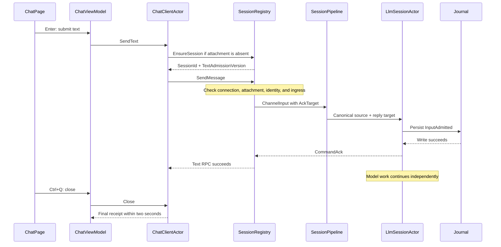

# Daemon Chat Client

Source PRDs: PRD-001, PRD-004, and PRD-009.
Use [the engineering glossary](../spec/GLOSSARY.md) for shared terms.
The rules live in [netclaw-cli](../../openspec/specs/netclaw-cli/spec.md) and
[session-resume](../../openspec/specs/session-resume/spec.md).

## Owners

| Component | Decision | State lifetime |
| --- | --- | --- |
| `DaemonClient` | Create and dispose the local runtime; expose the client API | Process-local |
| `SignalRDaemonHubTransport` | Map typed commands and notifications to SignalR; own callback registrations | Connection-local |
| `ChatClientActor` | Select the session; order inputs; own transport operations and elapsed deadlines | Actor-local |
| Event pump | Deliver immutable output and status outside the actor | Process-local |
| `ChatViewModel` | Own page state and user actions through Termina `InvokeAsync` | Page-local |
| `ChatPage` | Own keys, focus, scroll, and transcript nodes | Page-local |
| `HealthCheckStepViewModel` | Capture daemon generation and confirm the identity reload before chat | Operation-local |
| `SessionRegistry` | Check attachment, identity, and ingress before dispatch | Daemon-local |
| `SessionPipeline` | Map canonical source data and carry `AckTarget` | Pipeline-local |
| `LlmSessionActor` | Admit text and preserve its original authority | Durable journal |

The client uses a local actor provider. It has no remoting, cluster, journal, or model actor.
Offline bootstrap creates no client ActorSystem.
The first explicit daemon command creates the client runtime.
Host disposal stops the actor system and disposes the transport.

## Ordered flow

A fresh page connects without a daemon session until text or its hidden initial input arrives.
A resume page attaches when it opens.
The actor retains queued user text before a hidden initial input.
It attempts each input RPC once. It does not replay an uncertain attempt.

## Identity redo handoff

Identity redo captures the daemon generation before `ConfigEditorSession.Save`.
The config watcher applies that write through the existing daemon restart.
A running daemon without a generation blocks the write with a visible error.
The saved screen retains an explicit guided chat choice and skip option.
After that choice, the existing wizard readiness component confirms daemon health.
A daemon that already ran must report a newer generation.
A daemon that was down follows the existing start and health check.
The page then creates the onboarding trigger and enters chat.
Quit cancels that operation and its queued Termina callbacks.

Positive: generation 2 confirms the identity write after a generation 1 baseline.
Negative: the still-healthy generation 1 cannot authorize the hidden chat input.
This gate prevents the config reload from interrupting initial chat admission.
The client actor retains its rule against automatic resend after an uncertain RPC.

## Actor control

The actor permits one transport operation at a time.
`PipeTo` returns task results as messages while control commands remain available.
The actor uses `Become` for idle, active RPC, retry, and cancelled RPC behaviors.
Each behavior retains close, drop, and cancellation handlers.
Operation identities reject stale results.
Cancellation alone does not prove that transport side effects stopped.
The actor waits for the old task before it starts another operation.

`ChatClientProtocol` groups command, completion, control, and notification records.
Each command carries only its required payload. Session commands return `SessionId`; other commands return no value.
The transport converts `SessionId`, `ToolCallId`, and `ApprovalOptionKey` to wire strings at its boundary.
The actor queue holds requests that await a transport operation.
The typed event channel carries output and connection notifications to subscribers outside the actor.
These collections serve different consumers and lifetimes.

Records describe three independent state dimensions: session attachment, work, and close.
An attached session always carries its identity. A retry retains its request but has no active RPC resources.
A cancelled RPC retains its resource owner until the actual task ends. It retains no caller request to replay.
The RPC owner disposes its cancellation source and caller registration once.
Infrastructure fields remain separate from these state descriptors.
Recovery intent survives a disconnected bind reply and caller cancellation until automatic attachment succeeds.

The view-model applies page state before it publishes the same output to the transcript subscriber.
The page reads that state and changes terminal nodes on the Termina loop.
Escape, resize, usage, and turn completion no longer write view-model state from the page.
Usage-log files remain view-model resources. A separate follow-up can extract their lifetime without changing the actor protocol.
One view-model lock serializes resource disposal with callbacks. The existing Termina disposal flag rejects late callbacks.

Stable `IWithTimers` keys own retry, RPC, and close deadlines.
The two-second close limit covers all prior requests once.
The actor rejects later requests and never waits for a model response.
An unresolved dispatched RPC has unconfirmed delivery. Queued unstarted input is unsent.
The page stores the immutable receipt in the shared navigation state.
The terminal reads that result after alternate-screen exit.
This transfer preserves the init factory's lazy config and token read.
Each uncertain input retains its own session identity after a later session selection.
An unresolved interaction response also appears in the receipt.

## Compatibility and failure

Every attachment must advertise `TextAdmissionVersion = 1` before text dispatch.
A missing field or unknown version fails explicitly.
The client clears attachment state after a drop and checks support again.
An old client can ignore the new DTO property.
An old daemon cannot provide the new admission guarantee.

Only the defined `Text rejected: ` error prefix proves an explicit text rejection.
Other failures after dispatch retain unconfirmed delivery.
An admission response cannot restore generation after a turn-complete event.
The local guardian stops a failed actor. It does not restart the actor and discard its queue silently.

## Examples and proof

Positive: Enter followed by Ctrl+Q can exit after journal admission while the model still waits.
Negative: a queue write or an old daemon's early response cannot confirm admission.
Positive: a cancelled queued caller causes no RPC.
Negative: cancellation after dispatch cannot authorize automatic resend.

`SignalRAdmissionTests` reaches the real authenticated hub, gateway, pipeline, session actor, and journal.
Its theories cover rejection, buffered admission, and disconnect before or during the model request.
`ChatSessionSetupTests` uses virtual actor timers and controlled task results.
`ChatAdmissionTests` drives typed Enter and repeated Ctrl+Q through Termina.
Its bound-loop burst theories check delta payload order, usage state, approval state, and final Ready state.
The actor theories count active transport tasks through their actual completion, including cancellation and timeout.
The native `chat-admission-quit` tape checks the durable journal after immediate quit.

Forced process termination has no admission guarantee.
The client has no durable outbox. A session with zero completed turns can contain admitted work.
Do not delete such a session solely from its turn count.
