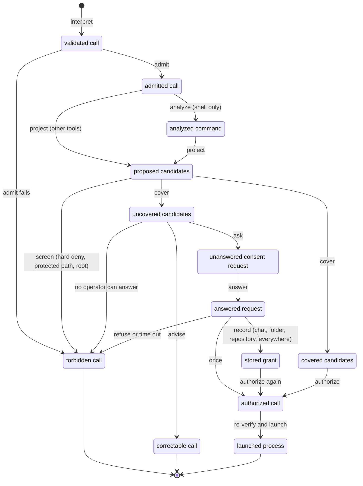
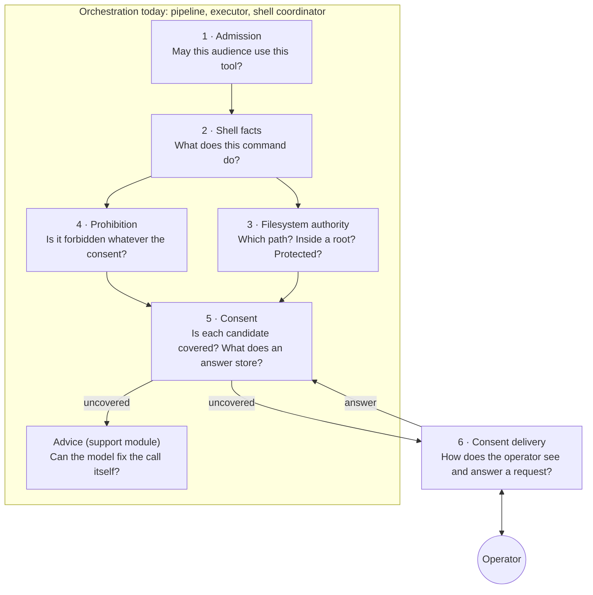
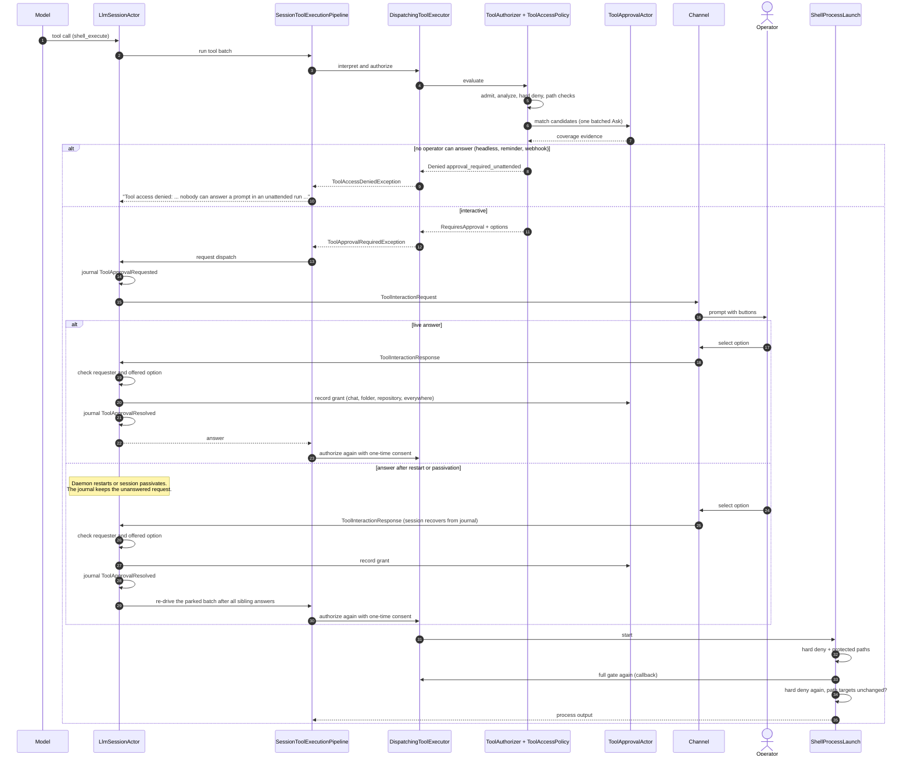

# Tool Authorization

This document explains how Netclaw decides whether a tool call can run. It is
the canonical architecture document for people. The testable rules live in the
[`tool-authorization` OpenSpec capability](../../openspec/specs/tool-authorization/spec.md).
This document links to those rules by ID (TA-1 to TA-16). It does not copy them.

Status: this document describes the code at `dev` revision `f7d407d6f`. Sections 2
to 5 name today's owners. A note with the label **Planned** describes a target
shape that no code has yet. The consolidation program changes one context per
PR. Each PR updates this document in the same diff.

Contents:

1. [What this covers](#1-what-this-covers)
2. [The lifecycle of one call](#2-the-lifecycle-of-one-call)
3. [The contexts](#3-the-contexts)
4. [One call, end to end](#4-one-call-end-to-end)
5. [Language](#5-language)
6. [Architecture guidelines](#6-architecture-guidelines)
7. [How to extend](#7-how-to-extend)
8. [Future scenarios and their support](#8-future-scenarios-and-their-support)
9. [How we know it works](#9-how-we-know-it-works)
10. [Why it has this shape](#10-why-it-has-this-shape)

## 1. What this covers

Tool authorization is every step between a model-authored
[tool call](../spec/GLOSSARY.md#tool-call) and the start of the tool. For a
shell call, it ends when the process starts. The result is one
[authorization](../spec/GLOSSARY.md#authorization) outcome:

| Outcome | What it means | Code value |
| --- | --- | --- |
| Allowed | The tool runs. | `ToolAuthorizationOutcome.Allowed` |
| Requires consent | The call waits for an operator answer. | `ToolAuthorizationOutcome.RequiresApproval` |
| Requires correction | The model must author a different call. | `ToolAuthorizationOutcome.RequiresAgentCorrection` |
| Denied | The call does not run, and no answer can change that. | `ToolAuthorizationOutcome.Denied` |

The code values are in
[`ToolAuthorizationDecision.cs`](../../src/Netclaw.Actors/Tools/ToolAuthorizationDecision.cs).

In scope:

- first-party tools, MCP tools, `shell_execute`, and `check_background_job`;
- the main session and subagents;
- interactive channels and non-interactive runs (headless chat, reminders,
  webhooks);
- the persistent grant store and the operator CLI for it.

Not in scope:

- network exposure, device pairing, and host authentication (see
  `daemon-exposure`, `device-pairing`, `hub-auth`, and `local-control-proof`);
- validation of tool arguments against a schema (`tool-arg-validation`);
- output bounds and spill (`bounded-tool-output`);
- containment of what an allowed process does after it starts. Netclaw has no
  OS sandbox. See [section 8](#8-future-scenarios-and-their-support).

## 2. The lifecycle of one call

A call moves through named stages. Each arrow is a verb. The model follows the
approval concept map of the consolidation program.

Notes on the diagram:

- "Screen" runs before "cover". A hard deny or a protected path ends the call
  before any grant lookup. See [TA-5](../../openspec/specs/tool-authorization/spec.md#requirement-ta-5-hard-deny-precedes-grant-lookup-and-repeats-at-launch).
- "Correctable" ends this attempt. The model authors a new call, which starts a
  new [authorization attempt](../spec/GLOSSARY.md#authorization-attempt).
- A non-shell tool has one candidate: the tool name. `file_write` and
  `file_edit` on a control-plane path use a path-scoped candidate.
- Today, the code has no type for each stage. One decision record
  (`ToolAuthorizationDecision`) and one mutable bag (`ToolApprovalAttempt` in
  [`ToolExecutionContext.cs`](../../src/Netclaw.Tools.Abstractions/ToolExecutionContext.cs))
  carry the stages. **Planned:** one closed type per stage (consolidation PRs 5
  and 6).

## 3. The contexts

A context owns one question and the words for that question. Other code calls
its published contract. It does not repeat its checks. Six contexts and one
support module make up tool authorization.

The arrows show the order in the current shell path. A non-shell call skips
"Shell facts". Today no single class owns the order. Three classes share it:

- [`SessionToolExecutionPipeline`](../../src/Netclaw.Actors/Sessions/Pipelines/SessionToolExecutionPipeline.cs)
  runs each call, catches a consent request, and asks the operator.
- [`DispatchingToolExecutor`](../../src/Netclaw.Actors/Tools/DispatchingToolExecutor.cs)
  runs the gate inside `ExecuteStreamAsync` through `GetAuthorizedToolAsync`
  and `EvaluateAuthorizationAsync`, which asks `ToolAuthorizer` for every call.
  `GetAuthorizedToolAsync` turns a decision that is not an allow into an
  exception, which the pipeline and the subagent loop catch. This exception is
  the contract between an executor and its callers.
- [`ShellPolicyCoordinator`](../../src/Netclaw.Actors/Tools/ShellPolicyCoordinator.cs)
  supplies the shell advice and the coverage.

[`ToolAuthorizer`](../../src/Netclaw.Actors/Authorization/ToolAuthorizer.cs)
(consolidation PR 6a) states the order as one list of rules: one line per
rule, and the first rule that decides wins. It returns a closed
[`AuthorizationDecision`](../../src/Netclaw.Actors/Authorization/AuthorizationDecision.cs)
(Allowed, NeedsConsent, CorrectionRequired, or Denied) and throws no exception
for an outcome. Each rule calls the component that owns its question. A
differential test proves that it gives the same decision as the old gate. Its
shell rules, in order:

1. Admission: audience, then shell capability.
2. Prohibition: hard deny, then protected shell text.
3. Filesystem authority: a `..` in the working directory, then each slice of a
   `cd` directory proof.
4. Filesystem authority: the working directory and the known paths must be in
   a trusted root of the audience profile. A protected path stays denied.
5. Admission: a Deny consent mode.
6. Advice: a native tool, then Auto mode with its directory advice.
7. A call without command text, the projected trusted-root check, and unresolved
   input: one-time consent or a Once-only request. Since approval taxonomy
   PR 5, a Bash call splits an unresolved source into commands: each
   unresolved command is one exact candidate, and the other commands go to
   rule 8 with their own candidates. Decision D1 lets a safe phrase or a grant
   for anywhere cover an exact candidate whose only unknown part is an operand.
8. Consent: a covering grant (stored grant, side-effect exemption, reviewed-safe
   policy), then the uncovered candidates.

Decision D2 (October 2026): an attended and an unattended call use the same
rules above. The file reach of an unattended call is the reach of its audience
profile, as in a chat. The one difference comes after rule 8: when nobody can
answer (headless chat, a reminder, a webhook, a sub-agent with no approval
bridge), the authorizer turns a consent request into the denial
`approval_required_unattended`. D2 removed the unattended-only trust zone, the
unattended unresolved-input denial, and the PR 6e rule that let a stored grant
replace a trusted-root denial for an unattended call.

Each context below lists its question, the classes that answer it today, its
published contract today, what it must not know, and where its data lives.
"Leaks today" lists known places where the current code breaks the "must not
know" rule. The leaks are the work list of the consolidation program.

### 3.1 Admission

| Item | Current state |
| --- | --- |
| Question | May this audience use this tool, in this shell mode and this consent mode? |
| Classes | [`ToolAccessPolicy`](../../src/Netclaw.Actors/Tools/ToolAccessPolicy.cs) (`AdmitAudience`, `IsToolExposed`, `EvaluateShellCapability`, `GetApprovalMode`), [`ToolAudienceProfileResolver`](../../src/Netclaw.Actors/Tools/ToolAudienceProfileResolver.cs), [`ToolAudienceProfiles`](../../src/Netclaw.Configuration/ToolAudienceProfiles.cs), [`ToolApprovalConfig`](../../src/Netclaw.Configuration/ToolApprovalConfig.cs), [`TrustContextPolicy`](../../src/Netclaw.Configuration/TrustContextPolicy.cs) |
| Published contract | `ToolAccessPolicy.AdmitAudience(...)` returns a denial or null. `ToolAuthorizer` returns the `AuthorizationDecision`. `IsToolExposed(...)` filters schemas. |
| Must not know | Grants, paths, shell syntax. |
| Data | Configuration. The result is call-local. |
| Rules | [TA-1](../../openspec/specs/tool-authorization/spec.md#requirement-ta-1-trust-context-is-explicit-and-fails-loud), [TA-2](../../openspec/specs/tool-authorization/spec.md#requirement-ta-2-schema-exposure-grants-no-authority), [TA-3](../../openspec/specs/tool-authorization/spec.md#requirement-ta-3-audience-profiles-admit-tools), [TA-4](../../openspec/specs/tool-authorization/spec.md#requirement-ta-4-consent-mode-and-shell-mode-resolve-per-audience-and-tool) |

Leaks today:

- `ToolAccessPolicy` also parses shell text, runs hard deny, and builds the
  prompt options.
- Two `ToolAudienceProfileResolver` instances exist: one in `ToolAccessPolicy`
  and one in `PathAccessPolicy`. `GetApprovalMode` reads the profile defaults
  directly.
- Two functions resolve the consent mode. A code comment says that people keep
  them consistent by hand.
- The effective shell mode is `Tools.ShellMode ?? Security.ShellExecutionMode ??`
  the posture default. Two keys carry one setting.

### 3.2 Shell facts

| Item | Current state |
| --- | --- |
| Question | What does this command do, in general shell terms? |
| Classes | ShellSyntaxTree through [`ShellCommandAnalysis`](../../src/Netclaw.Security/ShellCommandAnalysis.cs); candidate extraction in `ShellApprovalMatcher` ([`IToolApprovalMatcher.cs`](../../src/Netclaw.Security/IToolApprovalMatcher.cs)); [`ShellTokenizer`](../../src/Netclaw.Security/ShellTokenizer.cs) and [`ShellApprovalSemantics`](../../src/Netclaw.Security/ShellApprovalSemantics.cs) (legacy parser); [`BashDirectoryScopeProjection`](../../src/Netclaw.Actors/Tools/BashDirectoryScopeProjection.cs) (the directory of each occurrence after a Bash `cd`); [`ShellPolicyPathFacts`](../../src/Netclaw.Actors/Tools/ShellPolicyPathFacts.cs); [`ShellFileSystemTreeAccessPolicy`](../../src/Netclaw.Security/ShellFileSystemTreeAccessPolicy.cs) |
| Published contract | `ShellCommandPolicy.Analyze(...)` returns a `ShellCommandAnalysis`. `ShellApprovalMatcher.AnalyzeInvocation(...)` returns candidates and an "unresolved" flag (`IsMessy` in code). |
| Must not know | Grants, audience, the private grammar of an executable. |
| Data | Call-local. |
| Rules | [TA-7](../../openspec/specs/tool-authorization/spec.md#requirement-ta-7-shell-analysis-uses-general-syntax-facts) |

Leaks today:

- Two parsers read one command: ShellSyntaxTree and the legacy tokenizer.
  Hard deny and the protected-path check use both.
- Two projections produce candidates for one compound Bash command: the
  matcher candidates of the full parse, and the directory proof for a list
  with an exact `cd`. The directory proof also marks the diagnostics of a
  causal list (`cd dir && action; diagnostic`) for the reviewed-safe intent
  rule. That rule and the headless denial of a causal list stay until the
  owner changes the outcomes that they protect. The side-effect exemption
  (`echo`, `printf`, `:`, `true`, `false`) applies in a causal list too: the
  exempt command has no directory, so the list role does not change it.
- `ResolveAuthorizationScope` in `IToolApprovalMatcher.cs` names `find`, `cd`,
  `pushd`, and `Set-Location`. This conflicts with the Shell Approval
  Abstraction Rule in [`AGENTS.md`](../../AGENTS.md).

### 3.3 Filesystem authority

| Item | Current state |
| --- | --- |
| Question | Which exact path is this? Is it inside a boundary that the caller holds? Is it protected for this operation? |
| Classes | [`PathAccessPolicy`](../../src/Netclaw.Actors/Tools/PathAccessPolicy.cs) (`Evaluate`, `EvaluateShellPath`, `EvaluateReviewedShellPath`, `EvaluateGeneratedDestination`), [`ToolPathPolicy`](../../src/Netclaw.Security/ToolPathPolicy.cs) (protected lists), [`PathUtility`](../../src/Netclaw.Security/PathUtility.cs), [`ShellPathRules`](../../src/Netclaw.Security/ShellPathRules.cs), [`GitRepositoryApprovalScope`](../../src/Netclaw.Security/GitRepositoryApprovalScope.cs), [`DaemonToolPathPolicyFactory`](../../src/Netclaw.Daemon/Configuration/DaemonToolPathPolicyFactory.cs) |
| Published contract | `PathAccessPolicy.Evaluate(raw, context, FileOperation)` returns a [path access decision](../spec/GLOSSARY.md#path-access-decision): `Allowed(CanonicalPath)` or `Denied(...)`. |
| Must not know | Audience rules outside the root catalog, grants, shell syntax. |
| Data | Call-local. Git repository facts are read from disk at each check. The protected path sets are process-local. |
| Rules | [TA-6](../../openspec/specs/tool-authorization/spec.md#requirement-ta-6-path-access-decisions-own-file-tool-authority) |

Leaks today:

- More than 11 places check for a link, 3 functions normalize Windows paths,
  and 5 functions test containment with 3 different case rules.
- A platform temporary-path predicate from the Advice module also relaxes a
  link check for causal intent (`ShellPolicyCoordinator.cs`,
  `ToolAccessPolicy.cs`).
- `skill_manage` has its own mutation guard
  (`SkillManageTool.GuardMutationTarget`, #2247). The guard reuses
  `PathUtility.ContainsSymlinkSegment` and the shared `ToolPathPolicy`
  write-deny list, but it is one more place that composes the link and
  protection checks.

**Planned:** a closed `PathBoundary` union with three operations
(canonicalize, evaluate, resolve repository). See consolidation PR 3.

### 3.4 Prohibition

| Item | Current state |
| --- | --- |
| Question | Is this command or path forbidden, whatever consent exists? |
| Classes | [`ShellCommandPolicy`](../../src/Netclaw.Security/ShellCommandPolicy.cs) and its deny patterns, [`HardDenyRule`](../../src/Netclaw.Security/HardDenyRule.cs), [`HardDenyOverridesLoader`](../../src/Netclaw.Security/HardDenyOverridesLoader.cs), `ToolPathPolicy.CommandReferencesDeniedPath` |
| Published contract | `ShellCommandPolicy.Evaluate(analysis)` returns a `ShellCommandDecision`. `ToolPathPolicy.CommandReferencesDeniedPath(...)` returns a bool. |
| Must not know | Grants, prompts. |
| Data | Configuration (`Tools.HardDenyPatterns` and `config/hard-deny-overrides.json`). The rules are process-local. |
| Rules | [TA-5](../../openspec/specs/tool-authorization/spec.md#requirement-ta-5-hard-deny-precedes-grant-lookup-and-repeats-at-launch), [TA-6](../../openspec/specs/tool-authorization/spec.md#requirement-ta-6-path-access-decisions-own-file-tool-authority) |

Leaks today:

- An approved shell call runs the hard-deny list at least 4 times: in the gate,
  in the gate again inside the launch callback, and twice in
  `ShellProcessLaunch.CheckHardPolicies`.
- Some deny patterns name executables (`kill`, `rm -rf /`). This is policy
  data, which the Shell Approval Abstraction Rule permits. Since owner
  decision D2 (approval taxonomy PR 6), a kill is denied only when its operand
  text names the Netclaw daemon. It must not grow
  into a parser for an executable.
- Since ShellSyntaxTree 0.4.0-beta.17, the parser proves the value of a word
  that reads a binding (`x=/; rm -rf "$x"`). The hard-deny list also checks
  each proved value, and each value of a loop variable, so the bound form gets
  the decision of its literal twin. More than 256 value combinations deny.
- Owner decision D5 (option A): a glob word gets the decision of each literal
  protected path that its segments can match, or of a directory that contains
  one (`ToolPathPolicy.GlobMayReachDeniedPath`). The match is lexical: Netclaw
  does not list directories or follow links for this check. A link below the
  covering directory that leads to a protected path is an accepted gap.

### 3.5 Consent

| Item | Current state |
| --- | --- |
| Question | Is each candidate covered? What does an operator answer store? |
| Classes | [`ApprovalPatternMatching`](../../src/Netclaw.Security/ApprovalPatternMatching.cs), [`ToolApprovalActor`](../../src/Netclaw.Actors/Tools/ToolApprovalActor.cs), [`ToolApprovalStore`](../../src/Netclaw.Configuration/ToolApprovalStore.cs), [`ApprovalEntry`](../../src/Netclaw.Configuration/ApprovalEntry.cs), [`ApprovalBucketBuilder`](../../src/Netclaw.Actors/Sessions/ApprovalBucketBuilder.cs), [`ShellApprovalEvidence`](../../src/Netclaw.Actors/Tools/ShellApprovalEvidence.cs), [`OneTimeApprovalKeys`](../../src/Netclaw.Actors/Tools/OneTimeApprovalKeys.cs), [`ReviewedSafeShellPolicy`](../../src/Netclaw.Actors/Tools/ReviewedSafeShellPolicy.cs), [`ShellPolicyEvaluation`](../../src/Netclaw.Actors/Tools/ShellPolicyEvaluation.cs), [`ShellPolicyProjection`](../../src/Netclaw.Actors/Tools/ShellPolicyProjection.cs) |
| Published contract | `IShellApprovalMatchService.MatchShellCandidatesAsync(...)` (shell, one batched lookup), `IToolApprovalService.CheckApprovalAsync(...)` (other tools), `IStructuredToolApprovalService.RecordApprovalCandidatesAsync(...)` (store an answer). [`AkkaToolApprovalService`](../../src/Netclaw.Actors/Tools/AkkaToolApprovalService.cs) implements all three over `ToolApprovalActor`. |
| Must not know | Shell syntax (it receives candidates), channels. |
| Data | Persistent grants: `~/.netclaw/config/tool-approvals.json`, version 3, durable. Chat grants: actor-local in `ToolApprovalActor`. One-time consent: call-local keys in `ToolApprovalAttempt`. Coverage: call-local. |
| Rules | [TA-8](../../openspec/specs/tool-authorization/spec.md#requirement-ta-8-every-candidate-needs-coverage), [TA-13](../../openspec/specs/tool-authorization/spec.md#requirement-ta-13-the-persistent-grant-store-fails-closed) |

Leaks today:

- The code encodes a grant scope in 8 or more ways: `ApprovalDecision`,
  `ParentApprovalDecision`, option keys, `ApprovalGrantScope`, the nullable
  `Directory` and `Repository` fields of `ApprovalEntry`, `ShellCoverageKind`,
  and display strings.
- 9 places decide which output commands (`echo`, `printf`, `:`, `true`,
  `false`) need no consent.
- Grant match for one shell candidate can run up to 5 times in one gate run.

### 3.6 Consent delivery

| Item | Current state |
| --- | --- |
| Question | How does the operator see a request and answer it, now or after a restart? |
| Classes | Approval part of [`LlmSessionActor`](../../src/Netclaw.Actors/Sessions/LlmSessionActor.cs), [`ToolApprovalState`](../../src/Netclaw.Actors/Sessions/ToolApprovalState.cs), [`IApprovalChannel`](../../src/Netclaw.Actors/Sessions/IApprovalChannel.cs), [`ParentSessionApprovalBridge`](../../src/Netclaw.Actors/Sessions/ParentSessionApprovalBridge.cs), [`IParentApprovalBridge`](../../src/Netclaw.Tools.Abstractions/IParentApprovalBridge.cs), the approval loop in [`SubAgentActor`](../../src/Netclaw.Actors/SubAgents/SubAgentActor.cs), [`ApprovalResponseFlow`](../../src/Netclaw.Channels/ApprovalResponseFlow.cs), [`PendingApprovalLookup`](../../src/Netclaw.Channels/PendingApprovalLookup.cs), [`ApprovalButtonValueCodec`](../../src/Netclaw.Actors/Protocol/ApprovalButtonValueCodec.cs), [`ApprovalOptionKeys`](../../src/Netclaw.Actors/Protocol/ApprovalOptionKeys.cs), the Slack, Discord, and Mattermost prompt builders |
| Published contract | Output `ToolInteractionRequest` and input `ToolInteractionResponse` ([`SessionProtocol.Outputs.cs`](../../src/Netclaw.Actors/Sessions/SessionProtocol.Outputs.cs)). Journal events `ToolApprovalRequested` and `ToolApprovalResolved`. Option key strings such as `approve_once`. |
| Must not know | Policy rules. It renders the options that Consent offers. |
| Data | Durable session journal. Actor-local state for an unanswered request. A subagent request is live-only. |
| Rules | [TA-10](../../openspec/specs/tool-authorization/spec.md#requirement-ta-10-consent-prompts-offer-only-safe-options), [TA-11](../../openspec/specs/tool-authorization/spec.md#requirement-ta-11-an-unanswered-consent-request-survives-restart), [TA-12](../../openspec/specs/tool-authorization/spec.md#requirement-ta-12-subagent-consent-goes-through-the-parent-session) |

Leaks today:

- Two layers check that the person who answers is the requester: the channel
  (`PendingApprovalLookup`) and the session actor.

### 3.7 Advice (support module)

| Item | Current state |
| --- | --- |
| Question | Can the model fix this call itself, so that no prompt is necessary? |
| Classes | [`TemporaryPathCorrectionPolicy`](../../src/Netclaw.Actors/Tools/TemporaryPathCorrectionPolicy.cs), [`ManagedTemporaryCorrection`](../../src/Netclaw.Actors/Tools/ManagedTemporaryCorrection.cs), [`NativeToolShellCorrectionDetector`](../../src/Netclaw.Actors/Tools/NativeToolShellCorrectionDetector.cs), correction selection in `ShellPolicyCoordinator` |
| Published contract | `ToolAuthorizationDecision` with outcome `RequiresAgentCorrection` and a list of `ToolCorrection` values. |
| Must not know | It must not be an input to authority. |
| Data | Call-local. The managed-temp retry key is call-local state in `ToolApprovalAttempt`. |
| Rules | [TA-9](../../openspec/specs/tool-authorization/spec.md#requirement-ta-9-agent-correction-precedes-a-prompt-and-grants-no-authority) |

Leak today: `IsEligiblePlatformTemporaryPath` is also an authority input for
causal intent. **Planned:** move that rule into Filesystem authority as a named
link rule for the macOS `/tmp` alias.

### 3.8 Launch re-verification

[`ShellProcessLaunch`](../../src/Netclaw.Actors/Tools/ShellProcessLaunch.cs)
is the last step before a process starts. It checks hard deny and protected
paths, captures the known path targets, runs the full gate again through a
callback, checks hard deny again, and stops if a path target changed. See
[TA-14](../../openspec/specs/tool-authorization/spec.md#requirement-ta-14-launch-re-verifies-the-authorized-call).
#2122 added this shared check at process start to close a time-of-check to
time-of-use gap.

## 4. One call, end to end

This sequence shows a shell call that needs consent. The upper branch shows a
live answer. The lower branch shows an answer after the daemon restarts or the
session passivates.

Facts behind the diagram (current code):

- The pipeline catches the consent request in
  `SessionToolExecutionPipeline.cs` and returns the headless text when no
  operator can answer. Evals assert this exact text.
- The session actor journals the request before it sends the prompt
  (`HandleToolInteractionRequestDispatch` in `LlmSessionActor.cs`).
- An unanswered request does not keep the session in memory. An answer
  rehydrates the session and re-drives the parked batch
  (`HandleToolInteractionResponseWhenIdle`, `RedriveToolBatchForApproval`).
- No timer denies an unanswered request. The session and its subagents ask
  through one prompt, `ParentSessionApprovalBridge`, which waits with the
  session's approval timeout. The daemon sets that timeout to infinite. The
  request waits until the operator answers, the run is cancelled, or a new user
  message abandons the parked batch.
- A subagent request goes to the parent through `ParentSessionApprovalBridge`.
  It is live-only. After a restart, Netclaw rejects the old prompt as expired.
  A subagent without a parent bridge cannot ask. Its whole run fails with
  `ToolExecutionFailed`; it does not return a per-tool denial.
- A channel that cannot post a prompt sends `Deny` for that call
  (`ChannelOutputEngine`, `SlackThreadBindingActor`). This is the only
  automatic denial of a consent request.

A non-shell call follows the same path, with two differences. `ToolAuthorizer`
applies the rules for other tools and one `StoredGrantCheck` in place of the
shell coverage. The launch step does not exist.

## 5. Language

Each context uses its own words. The
[engineering glossary](../spec/GLOSSARY.md#authorization-language) defines the
shared words. This section shows which context uses each word and how the words
translate at each seam. It does not repeat the definitions.

| Context | Its words | Code names today |
| --- | --- | --- |
| Admission | audience, tool, consent mode, shell mode, admission | `TrustAudience`, `ToolAudienceProfile`, `ToolApprovalMode` (`Auto`, `Approval`, `Deny`), `ShellExecutionMode` |
| Shell facts | command occurrence, phrase, effective directory, unresolved syntax | `CommandOccurrence`, `ApprovalCandidate.Verb`/`VerbTokens`, `IsMessy` |
| Filesystem authority | canonical path, trusted root, boundary, file operation, protected path | `CanonicalPath`, `PathAccessDecision`, `FileOperation`, `ToolPathPolicy` lists |
| Prohibition | deny rule, hard deny | `DenyPattern`, `HardDenyRule`, `DenyCategory` |
| Consent | candidate, coverage, grant, grant scope, one-time consent | `ApprovalCandidate`, `ShellCoverageKind`, `ApprovalEntry`, `ApprovalGrantScope`, `OneTimeApprovalKeys` |
| Consent delivery | consent request, option, consent answer, requester | `ToolInteractionRequest`, `ToolApprovalOption`, `ApprovalDecision`, `ApprovalButtonValueCodec` |

Translation at each seam:

| Seam | From | To |
| --- | --- | --- |
| Shell facts → Consent | a command occurrence with its effective directory | one candidate (`ApprovalCandidate(Verb, Directory)`) |
| Consent → Filesystem authority | a folder grant scope | a folder boundary with the "links below the root" rule (`ApprovalPatternMatching.EvaluateApprovalScope`) |
| Consent → Filesystem authority | a repository grant scope | a Git common directory, proved again at each check (`GitRepositoryApprovalScope`) |
| Consent delivery → Consent | an option key (`approve_always`) | an answer (`ApprovalDecision.ApprovedAlways`), then a grant scope (`ApprovalGrantScope.Folder`) |
| Consent → Consent delivery | uncovered candidates | a consent request with options and display text |

Words to avoid in new prose, with the replacement:

- "trust zone": use "trusted root". The token stays in reason codes such as
  `shell_path_outside_trust_zone`.
- "messy": use "unresolved syntax". `IsMessy` stays as a code name.
- "policy" for an evaluator class: name the context. Use "policy data" for
  configuration.
- "decision" for the operator's reply: use "consent answer". "Decision" means
  the authorization outcome.

## 6. Architecture guidelines

Each guideline has one example that follows it and one example that breaks it.
A reviewer uses these guidelines to judge a change.

### 6.1 One owner per decision

Each decision has one owner. Other code calls that owner.

- Follows: `file_read` asks `PathAccessPolicy.Evaluate` for its path decision.
  It does not write its own containment check.
- Breaks: `SkillReadResourceTool` has its own link walker
  (`ContainsSymlink`), which repeats the Filesystem authority link rule with a
  different case rule.

### 6.2 A new check goes in the context that owns its question

Find the question first. Then put the check in the context that answers that
question.

- Follows: the rule "a Public audience cannot use `file_edit`" is an admission
  question. It lives in the audience profile data and `ToolAccessPolicy`.
- Breaks: the macOS `/tmp` alias rule is a filesystem question. Today it lives
  in the temporary-path advice code and relaxes an authority check.

### 6.3 Closed unions for stages and scopes

A stage or a scope is a closed set of cases. The compiler must find every
switch that needs a new case.

- Follows: `ApprovalGrantScope` is an abstract record with the cases Session,
  Folder, and Repository.
- Breaks: `ApprovalEntry` encodes six entry shapes through nullable fields. A
  null `Directory` means "everywhere". The compiler cannot check a switch over
  that.

### 6.4 No private executable grammar

Shell analysis uses general shell facts: syntax, control flow, typed values,
path scopes, and authority boundaries. It does not parse the options or
subcommands of one executable. A safe-verb list or a deny list is policy data.
See the Shell Approval Abstraction Rule in [`AGENTS.md`](../../AGENTS.md) and
[TA-7](../../openspec/specs/tool-authorization/spec.md#requirement-ta-7-shell-analysis-uses-general-syntax-facts).

- Follows: `git status` becomes a phrase from ShellSyntaxTree tokens. The
  reviewed-safe catalog lists that phrase as data.
- Follows: a shell grant covers exactly its command words, the ShellSyntaxTree
  `CommandWords` fact (0.4.0-beta.8 position rule). The words are the program,
  the verb slot (the first word after the program and its options), and the
  plain words after it. The arguments are free. `ApprovalPatternMatching.VerbChainEquals`
  compares the stored tokens with the candidate's words, so `gh -R o/r pr view 1`
  and `gh pr view 1 -R o/r` both match a `gh pr view` grant, a `gh` grant
  covers `gh --help` but not `gh auth logout`, and a `git push origin feature-x`
  grant does not cover `git push origin main`. Options, option values, paths,
  path patterns with `/`, words with a digit, quoted text with whitespace, and
  (after the verb slot) expansions and globs are arguments. So
  `dotnet build -c Release` gives `dotnet build`, and
  `gh pr update-branch $n` gives `gh pr update-branch`. Known limit: a plain
  word after a flag that takes no value is also skipped (`git push -f origin
  main` gives `git push main`). A word after the verb slot that names an
  existing file or directory (not a link) in the occurrence directory is a
  path operand, not a command word: with `Phobos.slnx` on disk,
  `dotnet build Phobos.slnx` gives `dotnet build`, and the file gets a path
  scope for the trusted-root and protected-path checks. The program word and
  the verb slot never drop, so a file named `push` does not change `git push`.
  ShellSyntaxTree is lexical, so `ShellApprovalMatcher.ProjectCommandWords`
  reads the disk once per word. An unknown occurrence directory drops no word,
  and an exact candidate keeps its words. The stored match kind keeps the name
  `TokenPrefix`, so the version-3 store does not change. A legacy phrase must also equal the words.
  Since approval taxonomy fix 5, the display verb does not count: the legacy
  phrase `dotnet list package` covers `dotnet list package --vulnerable`, whose
  prompt shows `dotnet list`. Policy data gives some programs a one-token chain
  (`echo`, `which`, `jq`); a bare-program grant for them also covers their
  plain words.
- Follows: a program path names a file, not a spelling (R1). When the
  program word has a slash, `ShellApprovalMatcher` replaces it with the
  lexical absolute path: it joins a relative path with the occurrence working
  directory (after each `cd`) and collapses `.` and `..`. The shared rule is
  `ShellProgramPath` in `Netclaw.Configuration`. So `cd /opt/bin && ./tool`
  and `/opt/bin/tool` give one grant, and `cd /tmp && ./tool` is another file.
  A bare name keeps its `PATH` meaning. The rule is lexical, because the
  existing `..`-after-link guard already makes such an occurrence unresolved.
  When the working directory is not known, the word keeps its spelling. A
  repository grant stores the path below the worktree root (`./scripts/x.sh`).
  The store reads older `~/x`, `/abs/x`, and folder `./x` grants as absolute
  paths at load time. A `./x` grant with no folder covers the files that the
  spelling can reach and is shown as a legacy program spelling. A `~/x`
  program has `Unknown` words in ShellSyntaxTree 0.4.0-beta.10, so it gets the
  `WriteProgramPathInFull` correction.
- Follows: a command word is its static value after quote removal. A program
  word can contain a space: `"my tool"`, `'my tool'`, and `my\ tool` are one
  word, and `"/opt/My App/bin/tool"` is that path (R1). The grant stores the
  word list. `ShellCommandWordText` in `Netclaw.Configuration` quotes a word
  with whitespace in the phrase text, so the prompt shows `'my tool'`. The
  phrase text is also a policy input: the program `"echo x"` has the phrase
  `'echo x'`, so it is not the approval-exempt verb `echo`. Unquoted, `my tool`
  is the program `my` and its word `tool`, which is another grant.
- Follows: `Unknown` command words mean that no grant can cover the call.
  They occur only when the verb slot holds a bare glob (`*`, `p?sh`), an
  expansion, a brace list, or word splitting (`git {push,fetch}`,
  `rm -f {a,b}.txt`). Reviewed-safe policy and the approval-exempt output commands still
  apply first. An uncovered candidate with `Unknown` words gets a rewrite
  correction (`ShellCommandWordsRewriteSuggested`, "Tool execution deferred:
  rewrite_shell_command_words"): the call does not run and does not prompt,
  and the rewritten call passes normal approval. A bare glob is correctable in
  both shells; the other causes are correctable in Bash only. A dynamic program
  name or a PowerShell script block keeps the one-time prompt (an unattended
  run denies it).
- Breaks: `ResolveAuthorizationScope` treats the first operand of `find` and
  `cd` as a directory. That is private grammar of two executables.

### 6.5 Grants keyed by audience and tool

A grant applies only to the audience and the tool that it names. A shell grant
never authorizes `file_read`. See
[TA-8](../../openspec/specs/tool-authorization/spec.md#requirement-ta-8-every-candidate-needs-coverage).

- Follows: `ToolApprovalActor` loads grants per `(audience, tool)`.
  `PathAccessPolicy` takes no grant as input.
- Breaks: a change that lets a folder grant for `cat` widen the file-tool roots.
  That change turns a shell consent into file authority.

### 6.6 Advice never grants authority

A correction tells the model how to author a better call. The better call
starts a new authorization attempt, which runs every check again.

- Follows: the managed temporary directory correction returns
  `RequiresAgentCorrection`. The model sends a new call, which passes every
  check again.
- Breaks: `IsEligiblePlatformTemporaryPath` relaxes a link check for causal
  intent. Advice data becomes an authority input.

### 6.7 Protection depends on the operation

A protected path has a rule per [file operation](../spec/GLOSSARY.md#file-operation).
One path can be readable and still be denied for write or for shell text.

- Follows: `file_read` of `netclaw.json` is allowed. A shell command that names
  `netclaw.json` is denied (`ToolPathPolicyTests`).
- Breaks: one "protected" flag for all operations. It either blocks the
  operator's own config reads or lets shell text write the config.

### 6.8 The outcome direction rule

A refactor keeps every outcome in the frozen case catalog. Only a named
fatigue-reduction change may move a case from "requires consent" to "allowed",
and it names a negative control that still prompts or denies.

| Change | Rule |
| --- | --- |
| Allowed → other | Always blocks the merge. |
| Denied → other | Blocks the merge without owner approval. |
| RequiresApproval → Allowed | Only a listed intended change with a negative control. |
| RequiresApproval → Denied | Needs owner approval. |

- Follows: a PR lists case ID `X` in
  `approval-outcome-intended-changes.json`, moves it to `Allowed`, and names an
  external-directory case that still prompts.
- Breaks: a consolidation PR that changes an expected outcome in
  `ShellApprovalCaseCatalog.cs` and updates the snapshot in the same diff.

`scripts/check-approval-outcome-direction.py` enforces this rule in CI. See
[TOOLING.md § Outcome Direction Check](../../TOOLING.md#outcome-direction-check).

## 7. How to extend

Each recipe names the context that owns the change and the tests to add. Run
the approval boundary set and the outcome direction check for every recipe.

### 7.1 Add a candidate kind (a new tool family)

1. Admission: add the tool to the audience profile defaults and the schema.
   Add a `ToolOverrides` mode only when the default is wrong.
2. Consent: give the tool one candidate. Today a non-shell tool uses its tool
   name. `FilePathApprovalMatcher` shows the one path-scoped form today: a
   control-plane key for `file_write` and `file_edit`. In the daemon, the
   write-deny list denies the config directory before that key applies
   (consolidation plan D5, tier A). Do not copy that pattern for a new tool.
3. Consent delivery: confirm that the prompt shows a safe display text.

Tests: an Admission case per audience (see `McpToolAudienceGrantsTests`), a
consent case for each option that the prompt offers (`ToolApprovalGateTests`),
and a display redaction case.

### 7.2 Add a grant scope

1. Consent: add a case to `ApprovalGrantScope` and to `ApprovalDecision`. Add
   an option key in `ApprovalOptionKeys`. Keep the current key strings.
2. Consent: extend `ApprovalEntry`, the v3 codec, and `ApprovalPatternMatching`.
3. Filesystem authority: prove membership with a boundary check, not with text.
4. Consent delivery: render the new option in every channel.

Today this touches 8 or more encodings (section 3.5). **Planned:** after
consolidation PR 5, a new scope is one union case.

Tests: `RepositoryWorktreeApprovalTests`-style isolation (scope A never covers
B), a store round trip in `ToolApprovalActorTests`, a rehydration case in
`ApprovalRehydrationTests`, and a mutation target on the membership check.

### 7.3 Add a path boundary

1. Filesystem authority: add the root source to the catalog in
   `PathAccessPolicy` (`ResolveAndMergeRoots` or the session roots). State which
   audiences get it.
2. Choose the link rule on purpose: links below the root, links at or below the
   root, or links from the filesystem root.
3. Protected paths still win.

Tests: `UnattendedPathAccessTests` (attended and unattended reach are equal)
and `PublicAudienceFileAccessPolicyTests` style cases for each audience, a link escape case, a protected path case, and a
review of the path-access mutation target.

### 7.4 Add a deny rule

1. Prohibition: add structured `HardDenyRule` data, or add a built-in pattern
   in `ShellCommandPolicy` only when it is a general rule.
2. Do not add a parser for one executable. If the rule needs a shell fact that
   ShellSyntaxTree does not give, keep the input unresolved and propose a
   ShellSyntaxTree capability.

Tests: a deny row in `ShellApprovalCaseCatalog.cs` that also shows 0 approval
service calls, a compound or pipeline form of the same command, and a
`ShellCommandPolicyTests` case.

### 7.5 Add a channel prompt

1. Consent delivery: render the `ToolInteractionRequest` options with their
   keys. Keep labels within `ApprovalOptionKeys.MaxLabelLength` (76).
2. Route the answer as a `ToolInteractionResponse` with the selected key.
3. Check the requester through `ApprovalButtonValueCodec`. Do not invent a
   second rule.
4. Add the channel type to `ChannelType.SupportsInteractiveApproval()` in
   [`ChannelType.cs`](../../src/Netclaw.Actors/Channels/ChannelType.cs) only
   when it can show a prompt and route the answer. A channel type that is not
   in that list fails closed for uncovered calls.

Tests: a prompt builder test (see the Slack, Discord, and Mattermost builder
tests), a requester-only test, a response parser test, and a rehydration test
for a prompt answered after restart. See also
[`docs/runbooks/adding-a-channel.md`](../runbooks/adding-a-channel.md).

## 8. Future scenarios and their support

Support levels:

- **Supported:** the design handles it without a new contract.
- **Needs a contract:** the design has a place for it, but a named contract is
  absent.
- **Not supported:** outside the design. The row gives the reason.
- **Planned:** an accepted decision that a named follow-up PR implements. It
  is not current behavior.

"Supported" describes where the change goes today. It does not mean that the
change is small.

| Scenario | Support | Where it goes |
| --- | --- | --- |
| A fatigue fix for a new safe shell form (home-tilde glob, a literal loop) | Supported | Shell facts plus Consent, under the outcome direction rule (6.8). |
| A new grant scope, for example per project | Supported | One scope case and one path boundary (7.2, 7.3). Today it touches 8 or more encodings. |
| A new tool family or MCP resource type | Supported | A new candidate kind (7.1). |
| A new channel prompt surface (Teams, Telegram) | Supported | Consent delivery renders the consent request (7.5). |
| Skill-plugin script execution (decision D7) | Needs a contract | Declared scripts, per-file hashes, and a grant on plugin identity in Consent, plus a skill-resources path boundary. Today a skill script runs as an ordinary `shell_execute` call. The open plugin stack (#2160, #2161, #2162, #2157, #2158) gives plugins no execution authority and puts the managed plugin root on the shell deny list. |
| Typed allow, prompt, and deny rules as policy data (#1898) | Needs a contract | Consent data and Prohibition data. |
| Team approvers and verified automation approvers | Needs a contract | Consent delivery: who may answer, and how the answer is recorded. |
| OS-level sandbox or executor containment | Not supported | Netclaw has no executor boundary. It would plug in at Admission (a shell mode) and at launch (section 3.8). The `SandboxOnly` shell mode exists but always denies. |
| Close the `skill_manage` parent-directory check-to-use window | Not supported today | The temp file uses create-new semantics, so a link at the temp name fails. A same-user process that can already write where the daemon writes can still swap a parent directory. That gives no new authority today. With a sandboxed executor, fix it in Filesystem authority with directory-handle operations. |
| A missing or unreadable audience becomes an error (owner decision, September 29) | Planned | Today some components fall back to `Public` (TA-1). A follow-up code PR makes each such fallback fail loudly. Until that PR merges, the fallback stays as TA-1 describes it. |
| A consent for repository A that covers repository B | Not supported, by design | This is an invariant. A repository grant covers only registered worktrees of one Git common directory (TA-8). |

## 9. How we know it works

Each invariant has a proof that runs in CI. The spec has the full map per
rule in its "Verification Map" section. The mutation gates are in
[TOOLING.md § Focused Mutation Tests](../../TOOLING.md#focused-mutation-tests)
and the approval tooling is in
[TOOLING.md § Approval Contract Tooling](../../TOOLING.md#approval-contract-tooling).

| Invariant | Proof |
| --- | --- |
| Every catalog case keeps its outcome, reason, candidates, and options. | `ShellApprovalDispositionMatrixTests` with `ShellApprovalCaseCatalog.cs` and the `.verified.md` snapshot |
| An allowed case stays allowed. A denied case stays denied. | `scripts/check-approval-outcome-direction.py` (CI job "Approval Outcome Direction") |
| Hard deny runs before any grant lookup. | Catalog rows expect 0 approval service calls on deny |
| Launch re-checks the exact call. | `DispatchingToolExecutorLaunchTests` |
| A repository A grant never covers repository B. | `RepositoryWorktreeApprovalTests`; the approval directory mutation gate |
| A folder grant stays inside its folder. | Catalog link rows; the approval directory mutation gate |
| Audience and MCP allow lists deny before dispatch. | `McpToolAudienceGrantsTests`; the tool authorization mutation gate |
| Session roots follow the audience. | `PathAccessPolicy` tests; the path access mutation gate |
| Shell facts stay general. | The shell analysis and shell assignment mutation gates; `ShellPolicyEvidenceFixtureTests` |
| An unanswered request survives restart. | `ApprovalRehydrationTests`; `ShellApprovalLifecycleIntegrationTests` |
| Non-interactive runs cannot get new consent. | Evals Category 9 in `evals/run-evals.sh`; `evals/background_evals.py` |
| `skill_manage` mutations refuse links and protected paths. | `SkillToolTests`; the skill_manage guard mutation gate ([TOOLING.md § Skill Manage Guard Gate](../../TOOLING.md#skill-manage-guard-gate)) |
| A shell grant never authorizes `file_read`. | No test yet. Consolidation PR 1b adds it. |
| `ToolAuthorizer` gives the same decision as the gate on `dev`. | The corpus differential ([TOOLING.md § Authorization Corpus Differential](../../TOOLING.md#authorization-corpus-differential)) |
| No `ToolAuthorizer` rule can move ahead of an earlier rule. | The tool authorizer order mutation gate ([TOOLING.md § Tool Authorizer Order Gate](../../TOOLING.md#tool-authorizer-order-gate)) |

Model guidance (which tool the model should choose, and how it should declare
a project directory) is not an authorization rule, and no spec owns it. The
tool descriptions and `ToolChoiceGuidance` own that text, and evals Category 9
in `evals/run-evals.sh` measure its effect. A guidance change must not change
an authorization outcome; the case catalog and the outcome direction check
catch such a change.

Evidence fixtures live in
[`src/Netclaw.Security.Tests/Evidence/`](../../src/Netclaw.Security.Tests/Evidence/README.md).
`scripts/authorization-metrics.py` measures the size of the authorization path
(see [TOOLING.md § Authorization Metrics](../../TOOLING.md#authorization-metrics)).

## 10. Why it has this shape

The consolidation plan (tool authorization consolidation, accepted September
29, 2026) records the decisions. The main ones:

| Decision | Summary |
| --- | --- |
| D1 | Freeze the behavior files. Allowed stays allowed. Denied stays denied. The direction of change is fewer prompts. |
| D3 | Replace and delete one context per PR. No runtime shadow mode. |
| D4 | One authorizer for every tool. Grants stay keyed by tool. |
| D6 | One OpenSpec capability for the testable rules, and this document for people. |
| D7 | Skill-script authority is a separate, later capability. |
| D8 | Security fixes first. Soft freeze on new approval mechanisms during the code slices. |

History that shaped the current code:

- #2246 moved the approval evidence out of OpenSpec and added the outcome
  direction gate and the metrics script.
- #2224, #2225, and #2226 ordered the shell approval policy flow and merged
  approval policy models.
- #2122 added the shared authority check at process start (launch
  re-verification).
- The archived OpenSpec changes under `openspec/changes/archive/` hold the
  detailed history of each mechanism.
