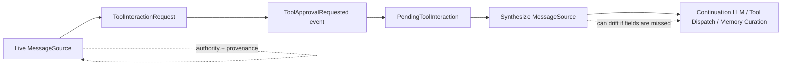
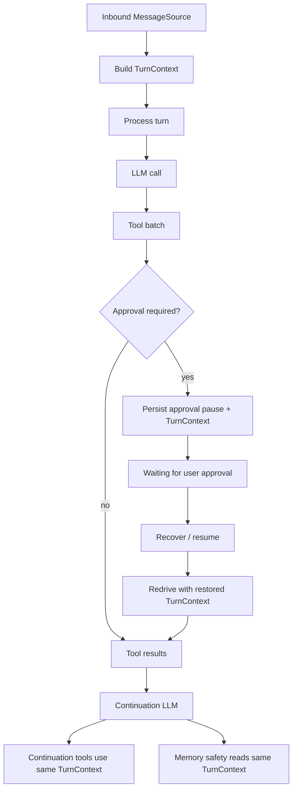
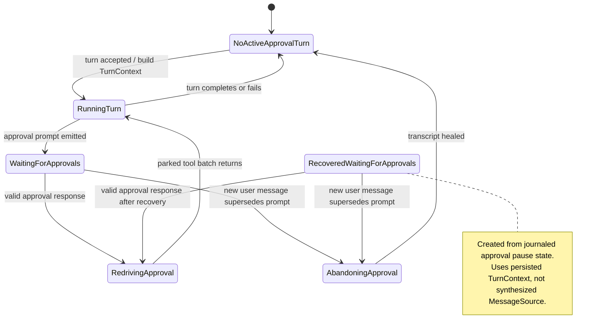
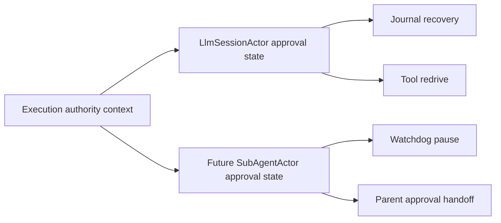

## Context

`LlmSessionActor` currently treats `MessageSource` as both transport metadata and the active turn's authority context. That works on the live path, but approval pause/resume now copies the same authority fields through `ToolInteractionRequest`, `ToolApprovalRequested`, `PendingToolInteraction`, redrive overrides, and `SynthesizeTurnSourceFromPending`.

The tactical fixes in #1203 closed the known bugs, but the design is fragile: adding or changing one trust-bearing field requires updating several shapes and then proving recovery behavior with long actor tests. The redesign should make approval-paused session work understandable as a small state machine and make the original turn authority a single explicit model.

This change is for `LlmSessionActor` only. The related `SubAgentActor` lifecycle work is tracked by #1212. Shared context models are desirable where the session and sub-agent semantics match, but approval lifecycle state should remain actor-specific.

## State Machine Diagrams

The current approval recovery path works, but authority and provenance are copied through several shapes before a recovered turn can continue.

The target shape builds durable turn authority once, persists it with approval pause state, and reuses it for every resumed operation.

At the actor level, approval turn state should be explicit beneath `SessionPhase` instead of inferred from nullable source state and pending dictionaries.

The reusable boundary with #1212 is the context data, not the lifecycle machine.

## Goals / Non-Goals

**Goals:**

- Make approval-paused session work resume after idle passivation or restart with the original requester, audience, boundary, channel capability, principal, provenance, and adopted-context policy state.
- Separate transport input (`MessageSource`) from durable execution authority (`TurnContext`).
- Introduce an approval turn state model that describes running, waiting, recovered, redriving, and abandoned approval-paused turns without relying on scattered dictionaries and null checks as the primary contract.
- Keep persistence changes additive and compatible with existing approval journals.
- Create direct test seams for context construction, persistence, restoration, and projection into tool execution and memory safety.
- Identify the subset of context data that #1212 can reuse for sub-agents without sharing session-specific lifecycle state.

**Non-Goals:**

- Redesign `SubAgentActor` approval waiting or watchdog behavior.
- Change Slack, Discord, or Mattermost approval rendering.
- Change persistent approval grant storage or matching semantics.
- Merge session and sub-agent tool pipelines in this change.
- Rewrite `LlmSessionActor` wholesale.

## Decisions

### Decision 1: Add a dedicated `TurnContext` model

`TurnContext` represents the authority and provenance of an executable turn. It is built once when a turn is accepted and is then used by approval persistence, approval recovery, continuation tool dispatch, and memory safety decisions.

The durable fields should be limited to execution/security meaning:

- `SessionId`
- `TurnId`
- `Audience`
- `Boundary`
- `ChannelType`
- `RequesterSenderId`
- `RequesterPrincipal`
- `Provenance`
- `HasAdoptedContext`
- `HasThirdPartyAdoptedContext`
- `AdoptedSpeakerIds`
- `SupportsInteractiveApproval`

Transport-only fields stay on `MessageSource`: `AckTarget`, reminder/background dedup ids, raw adopted-context projection entries, source message id, and other delivery details.

Alternative considered: keep synthesizing `MessageSource` from pending approval state. Rejected because it keeps the transport shape as the authority model and recreates the same field-drift failure mode.

### Decision 2: Split shared context from actor-specific state

The shared model should be the context, not the lifecycle state. A future #1212 design may reuse `TurnContext` or a smaller shared `ExecutionAuthorityContext` for sub-agent tool execution, but it should not reuse session-specific states such as recovered pending approval, journal redrive, compaction buffering, or abandonment healing.

This keeps the common data model useful without forcing `SubAgentActor` into `LlmSessionActor`'s persistence and recovery rules.

Alternative considered: one common approval state machine for sessions and sub-agents. Rejected for this change because session approval recovery is journal-driven while sub-agent approval waiting is primarily actor/watchdog lifecycle management.

### Decision 3: Add an approval turn state beneath `SessionPhase`

Keep `SessionPhase` as the coarse actor lifecycle (`Recovering`, `Ready`, `Processing`, `Compacting`, `Passivating`). Add a smaller approval turn state model owned by the session actor, for example:

- `NoActiveApprovalTurn`
- `RunningTurn(TurnContext)`
- `WaitingForApprovals(TurnContext, pending call ids)`
- `RecoveredWaitingForApprovals(TurnContext, pending call ids)`
- `RedrivingApproval(TurnContext, redrive plan)`
- `AbandoningApproval(TurnContext, reason)`

The exact names can change during implementation, but the invariant should not: approval handling reads a single actor-owned state object rather than reconstructing the current turn from unrelated fields.

Alternative considered: add approval states directly to `SessionPhase`. Rejected because approval state can overlap with compaction/passivation/recovery concerns and would make the coarse phase graph harder to reason about.

### Decision 4: Persist a `TurnContextRecord` with approval pauses

New `ToolApprovalRequested` events should persist an additive, serialization-safe `TurnContextRecord`. `PendingToolInteraction` should carry that record or the rehydrated `TurnContext` rather than duplicating each authority field.

Existing journals that lack `TurnContextRecord` must still recover. The compatibility path may build a `TurnContext` from the legacy fields already present on `ToolApprovalRequested`, but that path should be isolated, logged when incomplete, and treated as migration compatibility rather than a normal fallback.

Alternative considered: persist `TurnContext` only in snapshots. Rejected because outstanding approvals are journal-sourced state; snapshots are cache, not source of truth.

### Decision 5: Project `TurnContext` into tool, memory, and trust-context consumers

Tool dispatch should receive turn authority from `TurnContext`, not `MessageSource` plus redrive overrides. Memory recall, memory curation, checkpoint payloads, exposed tool filtering, and continuation LLM/tool calls should all read the active or restored turn context.

`MessageSource` may still be passed to code that needs transport-only fields during a live turn, but security-relevant decisions should not depend on reconstructing it after recovery.

Alternative considered: keep `_currentTurnSource` and add more helper methods. Rejected because helper methods hide the fact that the source can be absent after recovery.

### Decision 6: Prefer direct state tests over field-by-field cold recovery tests

Keep a small number of end-to-end approval recovery tests. Move field propagation coverage into smaller tests for:

- building `TurnContext` from a live `MessageSource`
- serializing and deserializing `TurnContextRecord`
- restoring pending approval state from journal events
- projecting `TurnContext` into `ToolExecutionContext`
- applying memory safety decisions with third-party adopted context

This should reduce long, fragile tests while preserving behavioral coverage.

## Risks / Trade-offs

- Persistence compatibility gaps → Add protobuf fields only; keep a narrow legacy event adapter; add round-trip and old-event recovery tests.
- `TurnContext` becoming a dumping ground → Limit it to durable execution/security meaning; keep transport delivery and runtime-only fields on `MessageSource`.
- Duplicate state during migration → Allow temporary coexistence of `_currentTurnSource` and `_currentTurnContext`; remove authority reads from `_currentTurnSource` before deleting compatibility helpers.
- Over-sharing with sub-agents → Share only context data whose semantics match; keep session journal/redrive state and sub-agent watchdog/waiting state separate.
- Behavior drift in memory curation → Add tests that prove recovered turns suppress automatic memory formation when third-party adopted context is present.
- Hidden fallback to Public on recovery → Treat missing required turn context as a loud recovery error or user-visible expired approval, except for documented legacy compatibility paths.

## Migration Plan

1. Add `TurnContext` and build it at session turn acceptance, while keeping existing behavior unchanged.
2. Replace session memory and tool-exposure authority reads with `TurnContext` reads on the live path.
3. Add additive persistence for `TurnContextRecord` on approval pause events and map it through pending approval state.
4. Restore `TurnContext` from pending approval state during cold approval redrive and stop synthesizing `MessageSource` for authority.
5. Remove redundant redrive override parameters once the tool pipeline consumes `TurnContext` directly.
6. Consolidate tests after equivalent direct context tests exist.

Rollback is straightforward before step 3. After step 3, rollback must tolerate journals containing the new additive fields; older binaries will ignore unknown protobuf fields only if the serialization path supports that safely. Do not remove legacy fields until a separate archival/migration decision is made.

## Open Questions

- Should the shared reusable model be named `TurnContext`, or should the reusable subset be named more narrowly, such as `ExecutionAuthorityContext`, with session-specific `TurnContext` wrapping it?
- Should `SupportsInteractiveApproval` be persisted as a nullable value for exact prompt-time fidelity, or normalized into a required bool when `TurnContext` is created?
- What should the user-visible behavior be when a legacy pending approval lacks enough context to restore safely: expired prompt notice, recovery failure, or explicit denial?
