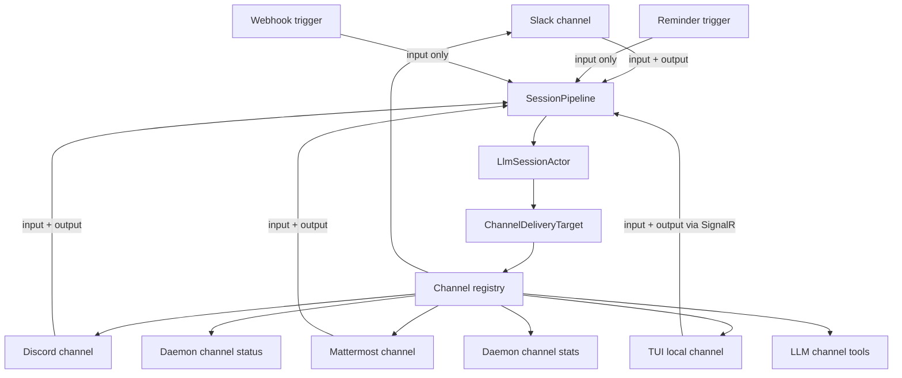

# Design

## Decision

Standardize channel delivery, not every transport. A channel is an addressable
output-capable conversation surface. Some channels also produce input. Trigger
sources such as reminders and webhooks produce input but are not channels; when
they need output, they must target a real channel delivery target.

The core flow is:

```text
InputSource -> Session Turn -> ChannelDeliveryTarget -> OutputChannel
```

Adapters keep platform-specific implementation details. The daemon and
LLM-facing tool registry consume standard channel descriptors, runtime snapshots,
address resolvers, and delivery target contracts.

Mattermost lifecycle actorization remains a valid reliability fix, but it is not
the top-level goal. It becomes one stateful-channel task after Mattermost can
report the same descriptor and runtime snapshot shape as Slack, Discord, and
future remote chat channels.

## Invariants

These statements are the long-lived grounding rules for this change. If later
implementation work conflicts with one of these, update the plan before writing
code.

- A channel is an addressable output-capable delivery surface.
- A channel may also be an input source, but input capability is not what makes
  it a channel.
- Reminders, schedulers, and webhooks are trigger sources. They are not channels.
- Trigger sources consume channel delivery targets when they need external
  output.
- Netclaw must not silently choose a default output channel for trigger-originated
  turns.
- SignalR is daemon infrastructure. TUI is the local interactive channel that
  uses SignalR.
- Session actors emit semantic `SessionOutput`; channels render those outputs
  through capability-declared effects.
- Descriptors and capabilities describe what can happen; ACL still depends on
  explicit trust context carried by the turn.
- The code samples in this design are illustrative seams, not mandated API names.

## Glossary And Abstractions

These examples are illustrative contracts, not final type names. The intent is to
show the seam each term describes and how the daemon would use it.

### Input Source

Anything that can start a session turn. A channel can be an input source, but not
all input sources are channels.

Examples: Slack message, Discord message, Mattermost message, TUI user input,
reminder fire, webhook event.

Abstraction:

```csharp
public sealed record InputSourceDescriptor(
    InputSourceKey Key,
    InputSourceKind Kind,
    string DisplayName,
    ChannelDescriptorKey? OriginatingChannel = null);

public enum InputSourceKind
{
    ChannelIngress,
    LocalClientIngress,
    TriggerSource
}
```

Interaction:

```csharp
var input = new ChannelInput(
    Text: "restart the build",
    Source: slackSource,
    DefaultDeliveryTarget: slackThreadTarget,
    TrustContext: resolvedTrustContext);

await sessionPipeline.SendAsync(input, ct);
```

### Channel / Output Channel

An addressable delivery surface Netclaw can emit output through. A channel may
also receive input. Channels participate in the unified channel model because
they can deliver output.

Examples: Slack, Discord, Mattermost, TUI session.

Abstraction:

```csharp
public sealed record ChannelDescriptor(
    ChannelDescriptorKey Key,
    ChannelType ChannelType,
    ChannelKind Kind,
    string DisplayName,
    bool IsEnabled,
    ChannelCapabilities Capabilities,
    IReadOnlySet<ChannelToolIntentKind> ToolIntents,
    IReadOnlySet<ChannelAddressKind> AddressKinds);

public enum ChannelKind
{
    RemoteChat,
    LocalInteractiveClient
}

public interface IChannelDescriptorProvider
{
    ChannelDescriptor GetDescriptor();
}
```

Interaction:

```csharp
var descriptor = slackDescriptorProvider.GetDescriptor();

if (descriptor.Capabilities.HasFlag(ChannelCapabilities.InteractiveApproval))
{
    toolRegistry.IncludeApprovalAwareTools(descriptor.Key);
}
```

### Trigger Source

A non-channel input source that can start a session turn but cannot deliver
conversational output by itself.

Examples: reminder, scheduler, webhook route.

Abstraction:

```csharp
public sealed record TriggerInput(
    InputSourceDescriptor Source,
    string Prompt,
    ChannelDeliveryTarget? RequestedDeliveryTarget);
```

Interaction:

```csharp
var trigger = reminderScheduler.Fire(reminderId);

var input = ChannelInput.FromTrigger(
    trigger.Prompt,
    source: trigger.Source,
    requestedDeliveryTarget: trigger.RequestedDeliveryTarget,
    trustContext: triggerTrustContext);

await sessionPipeline.SendAsync(input, ct);
```

### Channel Delivery Target

The resolved destination for output. It always points at a real channel and a
channel-specific destination, optionally with thread/root context.

For channel-originated input, the default delivery target usually comes from the
originating conversation. For trigger-originated input, the target must be
configured or selected when output should be emitted.

Abstraction:

```csharp
public sealed record ChannelDeliveryTarget(
    ChannelDescriptorKey ChannelKey,
    ResolvedChannelAddress Destination,
    string? ThreadOrRootId = null);
```

Interaction:

```csharp
var target = input.DefaultDeliveryTarget
    ?? input.RequestedDeliveryTarget
    ?? throw new InvalidOperationException(
        "This input source requested output but no channel delivery target was configured.");

await channelDelivery.SendAsync(target, sessionOutput, ct);
```

### Channel Registry

The daemon-owned index of output-capable channel descriptors, runtime snapshot
providers, and address resolvers. It does not register reminders or webhooks as
channels. Trigger sources consume this registry when they need delivery.

Abstraction:

```csharp
public interface IChannelRegistry
{
    IReadOnlyCollection<ChannelDescriptor> ListChannels();

    ValueTask<ChannelRuntimeSnapshot> GetSnapshotAsync(
        ChannelDescriptorKey key,
        CancellationToken cancellationToken);

    IChannelAddressResolver GetResolver(
        ChannelDescriptorKey key,
        ChannelAddressKind addressKind);
}
```

Interaction:

```csharp
foreach (var channel in registry.ListChannels())
{
    var snapshot = await registry.GetSnapshotAsync(channel.Key, ct);
    status.AddChannel(channel, snapshot);
}
```

### Runtime Snapshot

A live, point-in-time report of an output channel's current operational state.
This is not persisted state; it is used by status, stats, tool discovery, and
health reporting.

Abstraction:

```csharp
public sealed record ChannelRuntimeSnapshot(
    ChannelDescriptorKey Key,
    bool IsEnabled,
    ChannelHealthStatus Health,
    string? HealthDetail,
    bool? IsConnected,
    bool? IsReady,
    ChannelPrincipal? Principal,
    ChannelActivitySnapshot? Activity);

public interface IChannelRuntimeSnapshotProvider
{
    ChannelDescriptorKey Key { get; }

    ValueTask<ChannelRuntimeSnapshot> GetSnapshotAsync(
        CancellationToken cancellationToken);
}
```

Interaction:

```csharp
var snapshot = await mattermostSnapshotProvider.GetSnapshotAsync(ct);

if (snapshot is { IsEnabled: true, IsReady: false })
{
    logger.LogWarning("Mattermost is not ready: {Detail}", snapshot.HealthDetail);
}
```

### Address Resolver

A channel-scoped resolver for stable IDs and user-facing names. Slack, Discord,
Mattermost, and TUI do not share one mega resolver; each channel provides only
the namespaces it supports.

Abstraction:

```csharp
public sealed record ChannelAddressResolutionRequest(
    ChannelDescriptorKey ChannelKey,
    ChannelAddressKind AddressKind,
    string Query,
    bool RequireSingleMatch);

public sealed record ResolvedChannelAddress(
    ChannelDescriptorKey ChannelKey,
    ChannelAddressKind AddressKind,
    string StableId,
    string DisplayName);

public interface IChannelAddressResolver
{
    ChannelDescriptorKey ChannelKey { get; }

    ValueTask<ChannelAddressResolutionResult> ResolveAsync(
        ChannelAddressResolutionRequest request,
        CancellationToken cancellationToken);
}
```

Interaction:

```csharp
var resolver = registry.GetResolver(slackKey, ChannelAddressKind.Destination);

var result = await resolver.ResolveAsync(
    new ChannelAddressResolutionRequest(
        slackKey,
        ChannelAddressKind.Destination,
        "#ops-alerts",
        RequireSingleMatch: true),
    ct);

var destination = result.RequireSingle();
```

### Tool Intent Schema

The normalized argument model used by LLM-facing channel tools. Tool names can be
standardized, but adapter-specific execution still happens behind the registry
and selected channel implementation.

Abstraction:

```csharp
public sealed record SendChannelMessageIntent(
    ChannelDeliveryTarget Target,
    string Text);

public interface IChannelToolIntentExecutor
{
    ValueTask ExecuteAsync(
        SendChannelMessageIntent intent,
        ToolExecutionContext context,
        CancellationToken cancellationToken);
}
```

Interaction:

```csharp
var destination = await channelTools.ResolveDestinationAsync(
    channelKey: mattermostKey,
    query: "release-war-room",
    cancellationToken: ct);

await channelTools.SendMessageAsync(
    new SendChannelMessageIntent(
        new ChannelDeliveryTarget(mattermostKey, destination),
        "Deploy finished successfully."),
    toolContext,
    ct);
```

### Channel Output Effect

A semantic output event that a channel may render using native platform behavior.
Session actors emit meaning, not platform commands. Channels decide how to
render that meaning based on declared capabilities.

Examples: text message, message update, interactive approval prompt, file
attachment, processing indicator, reaction, thread rename.

Abstraction:

```csharp
public enum ChannelOutputEffectKind
{
    TextMessage,
    MessageUpdate,
    InteractiveApproval,
    FileAttachment,
    ProcessingIndicator,
    Reaction,
    ThreadRename
}

public interface IChannelOutputRenderer
{
    ChannelDescriptorKey ChannelKey { get; }

    ValueTask RenderAsync(
        ChannelDeliveryTarget target,
        SessionOutput output,
        CancellationToken cancellationToken);
}
```

Interaction:

```csharp
if (output is ProcessingStateOutput { IsProcessing: true }
    && descriptor.Capabilities.Supports(ChannelOutputEffectKind.ProcessingIndicator))
{
    await discordRenderer.RenderAsync(target, output, ct);
}
```

### Stateful Channel Lifecycle Owner

The adapter-specific component that serializes socket/API lifecycle state for a
remote chat channel. It can be an actor, hosted-service state machine, SDK
facade, or another single owner. The standard contract is the observable
snapshot and lifecycle behavior, not the implementation shape.

Abstraction:

```csharp
public interface IStatefulChannelLifecycleOwner
{
    event Func<string, Task>? CleanReconnectRequired;

    ValueTask<ChannelRuntimeSnapshot> ConnectAsync(
        CancellationToken cancellationToken);

    ValueTask DisconnectAsync(CancellationToken cancellationToken);

    ValueTask<ChannelRuntimeSnapshot> GetSnapshotAsync(
        CancellationToken cancellationToken);
}
```

Interaction:

```csharp
lifecycle.CleanReconnectRequired += reason =>
{
    reconnectQueue.Enqueue(new CleanReconnectRequest(channelKey, reason));
    return Task.CompletedTask;
};

var snapshot = await lifecycle.GetSnapshotAsync(ct);

if (snapshot.IsReady != true)
{
    ingressMetrics.RecordFilteredWhileNotReady(channelKey);
    return;
}
```

## Taxonomy

Netclaw needs to distinguish output-capable channels from input-only trigger
sources and daemon infrastructure endpoints.

| Kind | Examples | Meaning |
|------|----------|---------|
| Remote chat channel | Slack, Discord, Mattermost | External workspace/server channel that can deliver output and may receive input. |
| Local interactive channel | TUI, future web UI session | Local conversation surface that can deliver output and receive user input through daemon infrastructure. |
| Trigger source | Reminder, scheduler, webhook route | Input-only mechanism that starts a turn and consumes channel delivery targets when output is requested. |
| Daemon endpoint | SignalR hub | Infrastructure endpoint used by local clients. It has endpoint health, but it is not itself a channel delivery surface. |

Channels participate in the channel registry. Trigger sources do not. Daemon
endpoints may have operational status, but they do not advertise channel send,
lookup, or lifecycle capabilities unless represented by a logical channel such
as TUI.

## Capability Scope Matrix

| Surface | Input source | Output channel | Channel descriptor | Delivery target consumer | Address resolver | Runtime snapshot | Output effects | Stateful lifecycle |
|---------|--------------|----------------|--------------------|--------------------------|------------------|------------------|----------------|--------------------|
| Slack | Yes | Yes | Yes | Yes | Yes | Yes | Yes | Yes |
| Discord | Yes | Yes | Yes | Yes | Yes, where supported | Yes | Yes | Yes |
| Mattermost | Yes | Yes | Yes | Yes | Yes | Yes | Yes | Yes |
| TUI | Yes | Yes | Yes | Yes | Local/session-scoped only | Yes | Yes | No remote socket lifecycle |
| SignalR hub | No user turn by itself | No | No channel descriptor | No | No | Endpoint status only | No | Endpoint lifecycle only |
| Reminder/scheduler | Yes | No | No | Yes, when output is requested | No | Trigger status only | No | No |
| Webhook route | Yes | No | No | Yes, when output is requested | No | Trigger status only | No | No |

This table is deliberately asymmetric. The channel registry is for output-capable
channels. Trigger sources and daemon endpoints may have their own operational
status, but they do not become channels unless they can emit output through an
addressable conversation surface.

## Component Diagram



## Standard Channel Descriptor Shape

Each output-capable channel reports a stable descriptor with these concepts:

- Stable key, channel type, display name, and channel kind.
- Whether it is enabled by configuration.
- Capabilities: receive messages, send messages, direct messages, threaded
  conversations, interactive approvals, file ingress, file egress, user lookup,
  destination lookup, proactive messages, and runtime health.
- Tool intents it supports, such as send message, lookup user, and lookup
  destination.
- Address namespaces it can resolve, such as user, channel, room, thread, DM, or
  local session.

The descriptor describes what the channel promises. It must not grant ACL
permissions by itself. Actual turn authorization continues to flow through
`ChannelInput` trust context and existing policy checks.

## Runtime Snapshot Shape

Each output-capable channel reports a runtime snapshot with these concepts:

- Channel descriptor key and channel type.
- Enabled state.
- Health status and detail.
- Connected state when meaningful.
- Ready state when meaningful.
- Bot or service principal identity when the channel has one.
- Last known activity counters or timestamps when available.

Ready is channel-specific but comparable. For a remote socket channel, ready
means it can accept inbound events and send replies. For a local interactive
channel, ready means the session endpoint can route messages and render output.

## Trigger Source Output Routing

Reminders and webhooks are consumers of the channel delivery model. They create
input turns, but they do not deliver output themselves.

Rules:

- A trigger source that expects external output SHALL carry a configured or
  selected `ChannelDeliveryTarget`.
- A trigger source without a delivery target MAY create a fire-and-forget turn.
- If a trigger-originated turn attempts to emit external output without a target,
  Netclaw SHALL fail loudly instead of selecting a default channel.
- Trigger source status and route configuration MAY be reported by trigger
  subsystems, but trigger sources SHALL NOT be registered as channel descriptors.

## Address Resolution

Address resolution is standardized as a channel delivery intent, not as one
platform's ID model. Each channel provides its own resolver for the address
namespaces it supports. The channel registry routes a resolution request to the
resolver associated with the selected channel; it does not use a global resolver
that guesses across platforms.

Rules:

- Stable IDs are accepted when supplied.
- User-facing names are searchable where the backing platform supports it.
- Ambiguous names fail loudly with candidates instead of choosing the first
  match.
- Unsupported address kinds fail loudly for the selected channel.
- Resolvers do not silently fall back from one namespace to another.
- Resolved addresses carry both display data and stable platform IDs.

## LLM-Facing Channel Tool Intents

The LLM-facing tool surface should expose one generic tool per channel intent,
not one tool name per channel. Channel selection is an explicit argument so the
tool surface stays small while the runtime can still enforce descriptor-backed
capability checks.

The standard tool names are:

- `send_channel_message`: channel key, destination, text, optional thread/root
  target, optional audience/context hints.
- `lookup_channel_user`: channel key, query, optional exact-only flag.
- `lookup_channel_destination`: channel key, query, destination kind, optional
  exact-only flag.

Tool schema rules:

- `channel_key` is required, appears first in each schema, and is constrained to
  an enum generated from enabled channel descriptors.
- Tool descriptions must give explicit examples such as `channel_key=slack`,
  `channel_key=discord`, and `channel_key=mattermost` so smaller models do not
  have to infer the selector from prose alone.
- Lookup results must include the originating `channel_key`, address kind,
  stable platform ID, and display name.
- `send_channel_message` accepts resolved delivery destinations only. It rejects
  bare display-name recipients and requires callers to use lookup tools first
  unless they already have a stable platform ID.
- `send_channel_message` fails loudly when the requested `channel_key` does not
  match the delivery destination's `channel_key`.
- Unsupported capabilities, such as direct messages on a channel descriptor that
  does not advertise DM support, fail loudly instead of silently falling back to
  another address kind.

Direct-message workflow:

1. Resolve the user with `lookup_channel_user(channel_key, query)`.
2. Send with `send_channel_message(channel_key, destination.kind=direct_message,
   destination.id=<stable user id>, text=...)`.

This keeps a single send tool while preserving explicit channel and destination
intent. A channel-specific public alias should only be added if evals show the
generic enum-selected tool is unreliable for target model tiers.

Existing tool names such as `send_slack_message`, `send_discord_message`, and
`send_mattermost_message` are not compatibility requirements. The implementation
may rename them to the standardized tool names once the registry can enumerate
channels and resolvers reliably. System skills, CLI/help text, and evals must be
updated in the same implementation change when tool names change.

## Channel Output Effects

Session actors should emit semantic `SessionOutput` events. They should not emit
Slack-specific, Discord-specific, Mattermost-specific, or TUI-specific delivery
commands. The channel delivery layer maps each semantic output event to a native
platform rendering when the target channel declares support for that effect.

Rules:

- Channel descriptors declare supported output effects.
- Optional effects may be ignored when unsupported.
- Required effects fail loudly when unsupported.
- A channel-specific renderer may use native platform behavior, such as Discord
  typing indicators for a processing output signal.
- Adding a new cross-channel feature should add a semantic output/effect,
  descriptor capability, renderer behavior, and contract tests rather than a
  one-off platform branch in session logic.

Example mapping:

| Semantic output | Discord rendering | Slack rendering | Mattermost rendering | TUI rendering |
|-----------------|-------------------|-----------------|----------------------|---------------|
| `ProcessingStateOutput(true)` | trigger typing indicator | unsupported or future native/status rendering | unsupported or future native/status rendering | spinner/status line |
| Tool approval request | buttons | buttons | attachment actions | text options or local prompt |
| Message update | edit message | update message | update post | replace rendered block |

## Stateful Channel Lifecycle

Stateful remote chat channels must expose lifecycle through the standard runtime
snapshot. They may implement that lifecycle with actors, hosted services, SDK
callbacks, or another serialized owner, but the observable behavior must be the
same:

- Health reports disconnected, connecting, ready, degraded, and not-ready states
  consistently.
- Ingress is gated while the channel is not ready.
- Reconnects do not duplicate SDK event handlers.
- Unexpected disconnects can request a clean reconnect when the platform SDK
  requires a full stop/start cycle.

Mattermost likely needs an actor-owned lifecycle implementation to satisfy these
requirements. That should be implemented after the standardized snapshot shape
exists.

## Migration Plan

1. Add channel descriptor, runtime snapshot, delivery target,
   address-resolution, and tool-intent contracts without changing adapter
   behavior.
2. Add contract tests that enumerate output-capable channels and verify that
   reminders/webhooks are not registered as channels.
3. Adapt existing Slack, Discord, Mattermost, and TUI surfaces to report channel
   descriptors and snapshots using their current behavior.
4. Update reminder and webhook definitions so any requested external output uses
   explicit `ChannelDeliveryTarget` values.
5. Change daemon runtime status and stats to consume the channel registry instead
   of hard-coded Slack/Discord lists.
6. Normalize Slack, Discord, and Mattermost send/lookup tools onto standard
   channel intent schemas and rename current per-channel tools where needed.
7. Add name-searchable user and destination resolvers for supported channels.
8. Only after descriptors and snapshots are stable, implement adapter-specific
   lifecycle fixes such as Mattermost actorization.

## Multi-Window Implementation Guardrails

This change is likely to span multiple sessions and compaction windows. Preserve
the ordering and scope boundaries below to avoid reintroducing the old ambiguity.

1. Start with channel descriptors, delivery targets, and contract tests.
2. Do not implement a generic channel base actor first.
3. Do not register reminders, schedulers, webhooks, or SignalR as channels for
   convenience.
4. Do not add fallback logic that picks Slack, Discord, Mattermost, or TUI when a
   trigger source lacks a delivery target.
5. Do not migrate reminder or webhook output until `ChannelDeliveryTarget` exists
   and can fail loudly when missing.
6. Do not rename LLM-facing channel tools without updating system skills and eval
   cases in the same implementation change.
7. Do not actorize Mattermost as the first step; actorization comes after the
   standard runtime snapshot and lifecycle contract tests exist.
8. Do not let session actors call platform-specific delivery APIs. Add a semantic
   output effect and channel renderer instead.

## Non-Goals

- Do not rewrite all channel adapters in one pass.
- Do not create a generic channel base actor in this change.
- Do not register reminders or webhooks as channels.
- Do not make SignalR pretend to be a channel delivery surface.
- Do not change session identity formats.
- Do not weaken ACL, audience, principal, boundary, or provenance requirements.

## Risks / Trade-offs

- A descriptor model can become too abstract. Keep it tied to current runtime
  consumers: status, stats, tools, health, delivery, and address resolution.
- Generic tools can hide platform-specific constraints. Preserve channel
  capability flags and fail loudly when a requested intent is unsupported.
- SignalR needs special handling because it is daemon infrastructure used by
  local logical channels. Treat endpoint health and TUI channel capability as
  separate records.
- Trigger sources need explicit delivery targets. This may surface existing
  implicit-output assumptions in reminder or webhook flows, but failing loudly is
  safer than silently selecting a default channel.
- Mattermost lifecycle remains a reliability risk until actorized, but delaying
  it avoids changing adapter internals before the shared delivery seam is
  defined.
