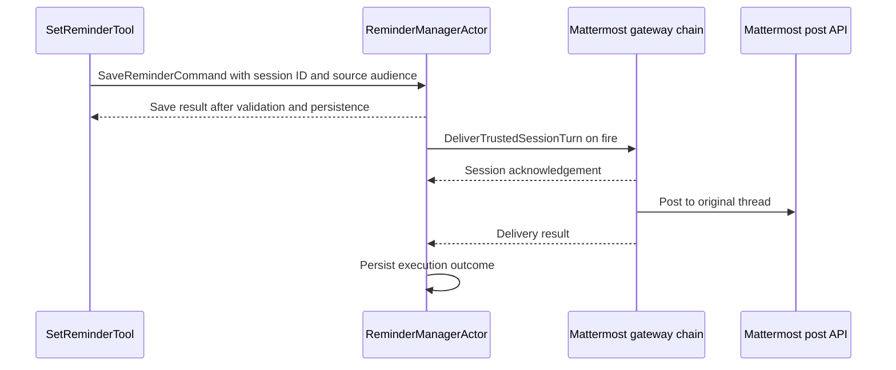

## Context

The creation gate omits Mattermost. The execution actor and adapter already support it.
The Mattermost spec requires current-session delivery. The schedule spec contains an older gateway list.
Use the [engineering glossary](../../../../docs/spec/GLOSSARY.md) for shared terms.

## Goals / Non-Goals

The change restores the existing Mattermost reminder contract and proves the route locally.
New driver APIs, new grant scopes, and live-server changes remain outside this change.

## Decisions

Add Mattermost to the explicit creation gate. Reuse the existing gateway route.
A new capability registry would add complexity to this small defect repair.

`SetReminderTool` owns call-local validation and emits the canonical session ID and channel enum.
`ReminderManagerActor` owns durable audience validation, definitions, schedules, and execution history.
`ReminderExecutionActor` selects the stored gateway. The session binding owns each delivery observer until the turn ends.

The local proof uses real reminder persistence, actors, and the Docker post API.
A deterministic session pipeline replaces the model. It acknowledges the input and emits text with the reminder key.
The test injects a scheduler envelope after creation. It does not wait for wall-clock time.

## Risks / Trade-offs

A session acknowledgement could hide a failed post. Test both successful and rejected posts.
A route could lose its thread ID. Fetch the server post and verify the stored target IDs.
A reminder could acquire broader authority. Keep manager validation and verify a Team-to-Personal request fails before persistence.

## Migration Plan

No data migration or driver update is required. Deploy the normal Netclaw build.
Rollback restores the previous gate and prevents new Mattermost current-session definitions through the tool.
