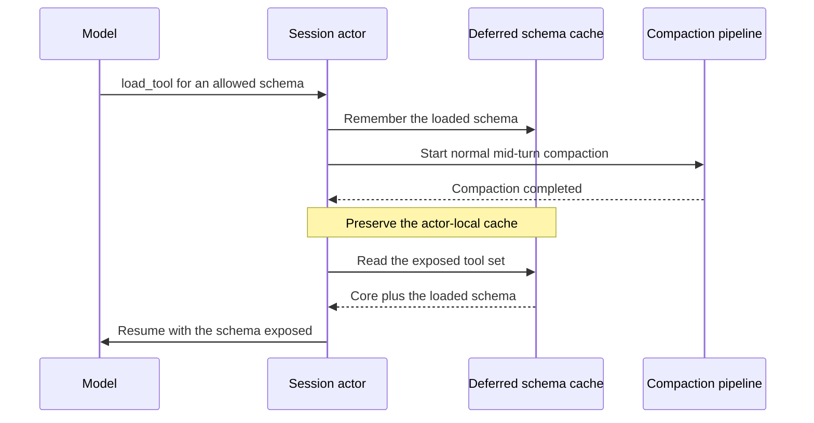
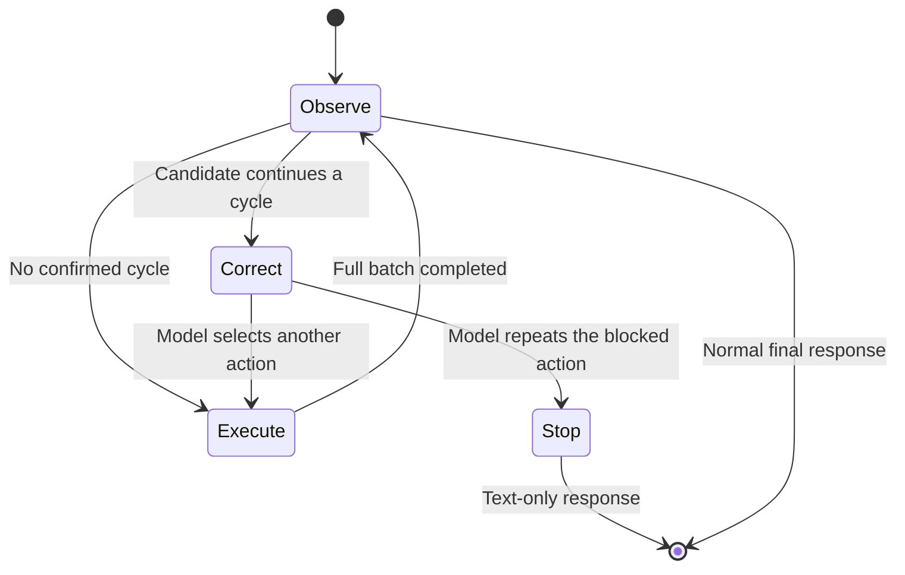

## Context

See [proposal.md](proposal.md) for the problem statement and scope.

The current `TurnStateTracker` counts calls and iterations. Its duplicate check
compares authored argument JSON and sends one advisory nudge.

The main actor canonicalizes tool names before persistence. Both execution paths
use `IToolExecutor` to validate arguments and remove Netclaw metadata.

The main pipeline returns results through `ToolCallResult`. The child path
returns the same model-visible messages and receipt categories in one batch.

Normal compaction currently evicts loaded schemas. Context overflow starts
compaction before the general LLM-failure eviction path runs.

The detector must not add persistence or expose sensitive payloads.

## Goals / Non-Goals

**Goals:**

- Detect exact action-and-outcome cycles with periods one through three.
- Block the next matching action before any policy prompt or side effect.
- Keep one implementation for parent and child decisions.
- Preserve every provider call-result pair after the first block.
- Validate the algorithm outside Netclaw before runtime integration.
- Replace both static iteration limits only after staged evidence passes.

**Non-Goals:**

- Estimate semantic progress or task value.
- Normalize timestamps, identifiers, paths, or tool-specific values.
- Carry a block into a later user turn.
- Persist detector state across actor recovery.
- Add a runtime switch, model profile, or provider option.
- Change tool authorization, approval grants, or execution authority.

## Decisions

### 1. Fix the observed trigger before the general guard

A successful normal compaction will preserve the current deferred-schema cache.
It will not refresh leases or change their order.

An LLM failure will evict the cache. The context-overflow branch will evict it
before it starts recovery compaction.

Recovery will continue to seed only the policy-exposed core. No schema state
will enter a journal event or snapshot.



Alternative: reload every referenced schema from compacted history. This route
would parse model context and could restore a stale or denied schema.

### 2. Use a small pure signature factory

A shared static factory will create immutable action and iteration signatures.
`TurnStateTracker` will own the six-entry history and the last blocked action.

The factory will use SHA-256 over typed, length-delimited data. Hash values will
remain actor-local and will never enter a log, event, snapshot, or exception.

The action input will contain these values:

- The registry's canonical tool name.
- Each call's validation state and stable rejection reason, if any.
- Accepted arguments after the existing metadata removal step.
- Original arguments, including invalid metadata, when validation rejects a call.
- Each duplicate call in the batch.

The canonical JSON writer will apply these rules:

- Sort object properties with ordinal comparison.
- Preserve array order and duplicate array values.
- Preserve numbers, strings, booleans, nulls, paths, cursors, and identifiers.
- Treat an absent argument object and an empty argument object consistently.
- Exclude the provider call identifier.

The factory will call the existing `ValidateToolCall` seam. It will not move
`InterpretToolCall` or execution out of the tool pipeline. This preserves the
pipeline's failure protocol. Valid rationale changes remain equivalent; a
missing rationale and its valid repair do not.

The factory will sort batch members by the tool name and argument hash. Equal
actions will use the outcome category and result hash as stable tie breakers.

The completion input will contain the typed receipt category and exact bounded
model-visible result text. The factory will hash UTF-8 bytes without text parsing.

Alternative: compare serialized dictionaries. Dictionary property order can
change, and metadata changes can evade that comparison.

Alternative: normalize timestamps or identifiers. Such rules can hide real
changes and create false execution blocks.

### 3. Keep the recurrence algorithm inside the existing turn owner

`TurnStateTracker` will expose three distinct operations:

1. Evaluate a prepared candidate before dispatch.
2. Observe one fully completed iteration.
3. Reset state at a user-turn boundary.

The actor will retain the action signature for the active batch. It will map
each result to its request before it records a completed iteration.

The tracker will test periods in ascending order. It will compare the last two
copies of each possible period and derive the expected next action.

This pseudocode is schematic. It omits authorization and persistence gates.

```text
evaluateBeforeDispatch(candidate):
  if candidate equals lastBlockedAction:
    return StopRun

  for period in 1..3:
    required = period * 2
    if completedHistory has fewer than required items:
      continue

    first  = completedHistory[-required .. -period]
    second = completedHistory[-period .. end]
    if first equals second and candidate equals first[0].action:
      lastBlockedAction = candidate
      return BlockWithCorrection(period, repetitions = 2)

  return Execute

observeCompleted(iteration):
  append iteration
  keep only the last six
  if lastBlockedAction exists and iteration.action differs:
    clear lastBlockedAction
```

A cancelled batch, a partial batch, and a batch that waits for approval will
not enter the completed history. An approval redrive will remain part of its
original candidate and will not receive a second cycle check.

Alternative: add a new actor or service. The state is turn-local, so another
owner would add synchronization and lifecycle work.

### 4. Use two intervention stages

The first block will preserve the authored assistant tool-call message. The
main actor will persist its normal batch-start event.

The actor will then create one synthetic `ToolCallResult` for each call. It
will send those results through the existing single-result and batch-completion
handlers.

Each correction receipt will use `RecoverableCorrection` and the new closed
code `BreakToolCycle`. The model text will state that no call executed.

The blocked batch will count against the temporary iteration limit. It will not
enter the detector's completed-iteration history.

If the model repeats the blocked action, the actor will not persist that second
tool-call response. It will add the final nudge and make a text-only model call.
This rule prevents an orphaned tool-call message.

The child actor will use the same decisions. It will add the first correction
pair to its transient history and will mark a forced final result as partial.



Alternative: mask one tool. A batch can contain several tools, and masking can
remove a tool that a valid alternative still needs.

Alternative: force a named alternative tool. Narration is not an authority for
tool selection, and the intended tool can still require approval.

### 5. Make text-only state monotonic within one turn

`ForceNoToolsActive` will remain true until the turn ends or a new user turn
resets the tracker. Empty-response retries and normal compaction will reuse it.

The existing reset for tool activity will stop clearing this state. A forced
call will retain a closed reason for accurate parent and child results.

The parent buffer will retain whether a message is new input or an overflow
replay. One drain helper will consume that origin at all four drain paths.
New input resets the tracker after the old batch completes. Replay alone
preserves it. A reset also discards the old batch's budget decision.

Detector diagnostics will use a constant type source without actor or session
context. Tests will inspect the complete event, including its source and properties.

Alternative: pass `forceNoTools: true` at selected call sites. This repeats the
policy and can miss another retry path.

### 6. Use the existing MCP invocation context for typed failures

`McpToolResultFormatter.TryGetErrorDetail` already reads the protocol's
`isError` field. Both MCP invocation paths will use that typed result before
they format the model text.

The daemon-managed path already receives `ToolInvocationContext` through
`IMcpToolInvoker`. It will complete a `TransientFailure` receipt when `isError`
is true. The bound-tool path will do the same in `McpToolAdapter`.

The dispatcher uses first-writer-wins receipt completion. Its later success
completion cannot overwrite the typed failure.

No interface, result wrapper, or text-prefix parser is necessary.

Alternative: return a new typed result from `IMcpToolInvoker`. The existing
context already carries the receipt seam, so that interface change adds no value.

### 7. Validate in a disposable laboratory first

The first implementation step will create a temporary `CycleDetectorLab`
outside the repository. It will use only the .NET base class library.

The laboratory will contain `Program.cs` and sanitized `cases.jsonl`. It will
copy the proposed record shapes and pure algorithm, then exit on the first error.

The deterministic corpus will include these cases:

1. The known period-one failure shape.
2. Changed rationales with equal execution arguments.
3. Changed JSON object property order.
4. Corrected arguments after validation failures.
5. Equal polls with changing results.
6. Equal polls with unchanged results.
7. A period-two cycle.
8. A period-three cycle.
9. A mixed-result parallel batch.
10. A repeated mutation request.
11. Compaction between repeated iterations.
12. A new user turn between repeated iterations.
13. A repeated request after the first block.
14. Success text that starts with `Error:`.
15. A tool-declared failure with a non-success receipt.

A fixed-seed generator will run at least 10,000 sequences. It will prove object
order invariance, array sensitivity, metadata removal, identifier sensitivity,
call-ID removal, result sensitivity, state resets, and the six-entry bound.

A private local extractor will replay the known incident and representative long
successful sessions. It will print aggregate decisions and sequence ordinals only.

The extractor will not print or store raw arguments, results, hashes, session
identifiers, user identifiers, or channel identifiers. No private fixture will
enter the repository or Memorizer.

The aggregate report will use this shape:

```text
cases=<count>
iterations=<count>
expected_blocks=<count>
actual_blocks=<count>
false_blocks=<count>
missed_blocks=<count>
first_known_loop_blocked_before_execution=<true|false>
```

The existing eval harness will probe the target model through its provider relay.
The relay will create repeat requests with fresh call IDs. The real daemon will
execute tools and own each correction or terminal stop.

One path will allow another tool after correction. One path will force text only.
The relay will pass control to the target model only after the daemon intervenes.
An external counter will verify that the third side effect does not occur.

A third case will force normal compaction through synthetic provider token usage.
It will require a real compaction completion between the first two executions.
Two controls will verify that changed results and valid metadata repairs permit work.

These opt-in cases will reuse `evals/run-evals.sh`, its isolated daemon, and its
result archive. See [the eval recipe](../../../evals/README.md#tool-cycle-cases).
They will preserve production resource limits and use synthetic data only.

The model probe will measure correction quality in the parent actor. It will not
replace deterministic detector tests, child actor tests, private replay, or observe-only evidence.

The report separates the initial runtime contract, post-handoff safety, and strict model task checks.
An initial correction does not prove that all later actions remain safe.
A different completed action clears the prior block. Changed results can permit further mutations.
The strict result still requires every check. Absent evidence never counts as a pass.
The prompt defines completion as recovery-value retrieval and requires `file_read` for that task.
The original run retains its original score when the prompt or oracle changes.

Compaction phase evidence follows this existing flow:

```text
LlmSessionActor -> CompactionOutput -> SessionOutputDto -> SignalR JSON -> DaemonClient -> HeadlessChannel
```

The mapper must preserve `Summarized` and `ToolResultsCleared` in both directions.
The nullable DTO fields apply only to compaction messages. Older payloads can omit them.
The existing consumer uses false for absent phase evidence; false does not prove that an older daemon skipped the phase.
Four JSON round-trip cases verify independent true and false values.
A true summary flag proves phase execution, not semantic retention of the task goal.

Alternative: start with actor integration tests. They add infrastructure noise
before the pure comparison contract is stable.

### 8. Deliver the change in evidence-gated slices

Slice one will correct the trigger and adjacent contracts. It will preserve
normal-compaction schemas, classify MCP `isError`, and preserve text-only state.

Slice two will add the shared detector in observe-only form. It will execute all
calls and emit payload-free `would_block` diagnostics.

Slice three will enable the first synthetic correction. The iteration limits
will remain active as emergency guards.

Slice four will enable the repeated-block terminal stop. Parent and child tests
will prove equal decisions.

Slice five will remove the parent configuration property and child constant.
This slice can start only after all acceptance gates pass.

Each slice can use a separate pull request. The OpenSpec change will remain
active until slice five passes verification.

## Risks / Trade-offs

- [Exact comparison misses noisy loops] -> Keep the temporary limits until replay evidence passes.
- [A hash collision could block valid work] -> Use SHA-256 over typed, length-delimited inputs.
- [Parallel result order could change] -> Pair results by call ID, then sort deterministic member tuples.
- [A mutation can repeat legitimately] -> Require two complete equal cycles before the first block.
- [A blocked tool call could orphan history] -> Persist paired correction results through the normal path.
- [Approval redrive could look like repetition] -> Check only new model candidates, not redrives.
- [Compaction can erase guard state] -> Keep detector and text-only state outside compacted history.
- [Logs can leak sensitive values] -> Log only period, repetitions, and decision.
- [A success string can look like an error] -> Use receipt categories and typed MCP `isError` only.
- [The final limit removal can increase cost] -> Require zero confirmed false blocks and successful shadow evidence.
- [Another active change can alter a shared requirement] -> Reconcile active tool and subagent deltas before implementation starts.

## Migration Plan

1. Run the disposable laboratory and private replay gates.
2. Merge slice one without detector behavior changes.
3. Merge the observe-only detector and collect aggregate evidence.
4. Enable correction after every proposed block receives review.
5. Enable terminal stop after parent and child parity passes.
6. Remove both limits only after all final acceptance gates pass.
7. Update the configuration schema, documentation, and operations skill in slice five.
8. Run the behavioral eval suite because a `SessionConfig` default disappears.

Rollback before slice five restores observe-only behavior and keeps both limits.
Rollback after slice five restores the old property and its schema entry.

The removed property needs no durable migration. An older binary uses its
built-in default when a corrected configuration omits the property.
